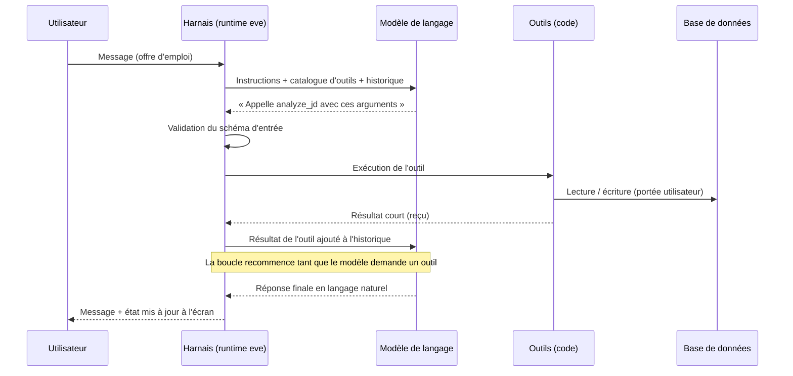
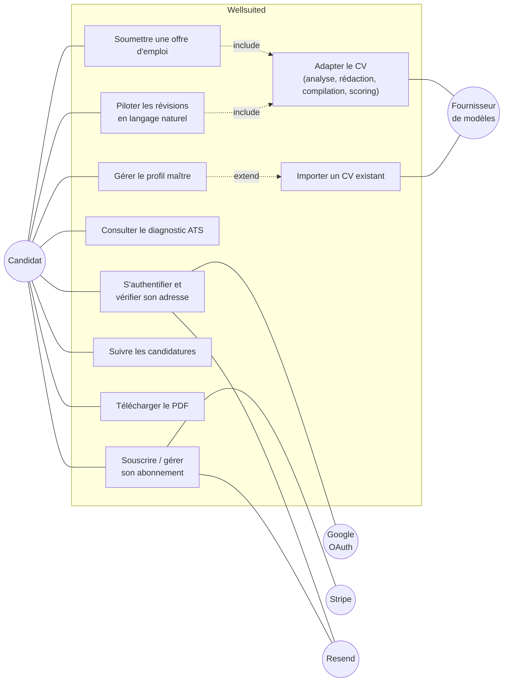
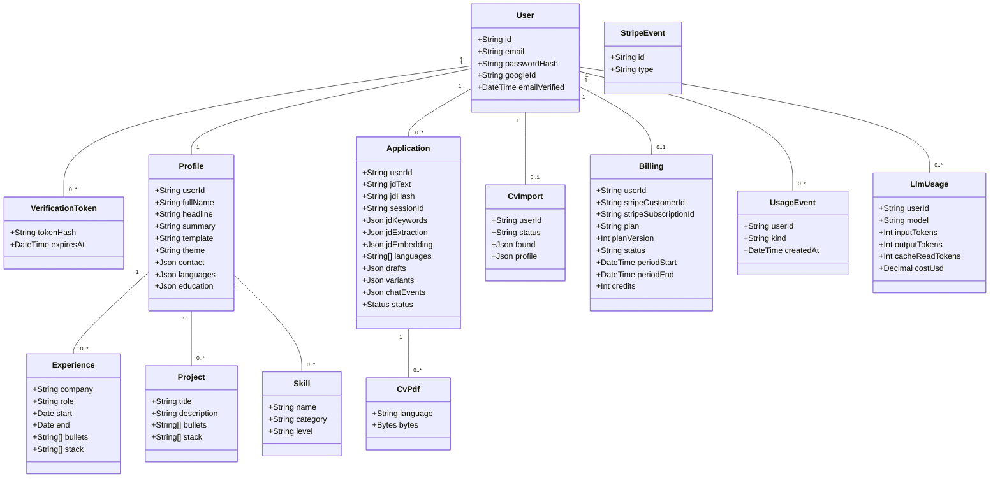
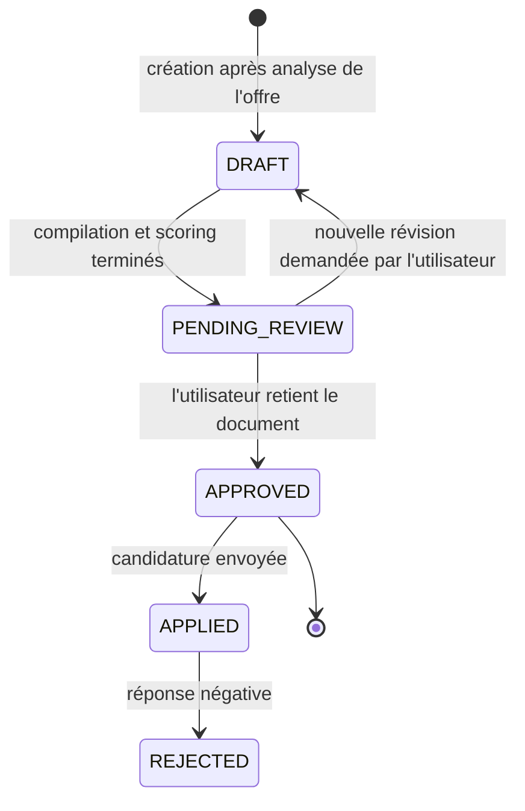
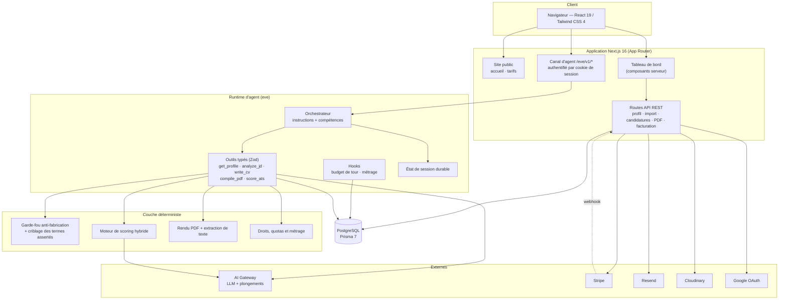
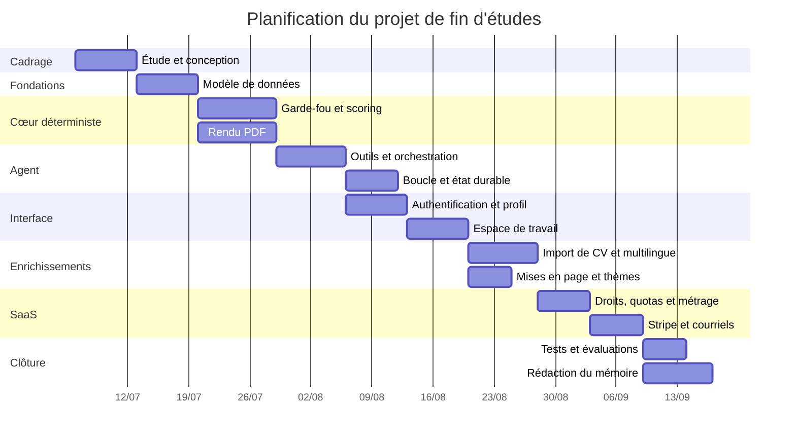
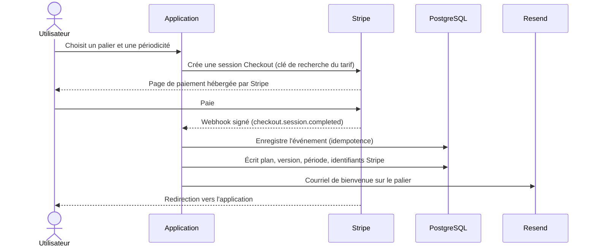

# Mémoire de projet de fin d'études

**Conception et réalisation d'une plateforme SaaS pilotée par un agent IA pour l'adaptation automatisée de CV aux offres d'emploi — *Wellsuited***

---

| | |
|---|---|
| **Étudiant** | Youness Hassoune |
| **Établissement** | *[Nom de l'école / université — filière]* |
| **Organisme d'accueil (le cas échéant)** | *[Nom de l'entreprise]* |
| **Encadrant professionnel** | *[Nom, fonction]* |
| **Encadrant pédagogique** | *[Nom, fonction]* |
| **Période du projet** | *[jj/mm/aaaa] – [jj/mm/aaaa]* |
| **Année universitaire** | *[20xx – 20xx]* |

> **Note de rédaction.** Ce document est une base de travail complète et cohérente. Les éléments qui ne peuvent être déduits du projet lui-même — nom de l'organisme d'accueil, organigramme, dates exactes, noms des encadrants — sont signalés en *italique entre crochets* et doivent être renseignés dans la version finale. Tout le contenu technique (architecture, modèle de données, algorithmes, technologies, modèle économique, tests) est fidèle au code réellement produit.

---

## Table des matières

- [Résumé](#résumé)
- [Abstract](#abstract)
- [Introduction générale](#introduction-générale)
- [Chapitre I : Contexte général du projet](#chapitre-i--contexte-général-du-projet)
- [Chapitre II : Étude et analyse du projet](#chapitre-ii--étude-et-analyse-du-projet)
- [Chapitre III : Réalisation](#chapitre-iii--réalisation)
- [Conclusion et perspectives](#conclusion-et-perspectives)
- [Bibliographie](#bibliographie)
- [Webographie](#webographie)

---

## Résumé

Le recrutement contemporain est massivement médiatisé par des logiciels de suivi des candidatures (*Applicant Tracking Systems*, ATS), qui filtrent, indexent et classent les CV avant toute lecture humaine. Un candidat compétent peut ainsi être écarté non pour un défaut de qualification, mais parce que son CV — rédigé une fois pour toutes et envoyé tel quel à des dizaines d'offres — ne parle pas le vocabulaire de l'annonce. Adapter manuellement un CV à chaque offre est en revanche une tâche coûteuse, répétitive et sujette à deux dérives symétriques : le bourrage de mots-clés et l'invention pure et simple de compétences.

Le présent travail, mené au sein de *[l'organisme d'accueil]*, a consisté à concevoir et réaliser **Wellsuited**, une plateforme SaaS (*Software as a Service*) dont le cœur est un **agent IA** : un grand modèle de langage (LLM) placé dans un *harnais d'outils* (*tool harness*) qui lui donne, sous contrôle du code, un accès borné à la base de données, à la génération documentaire et au moteur d'évaluation. L'utilisateur maintient un **profil maître** unique — sa vérité factuelle — puis colle une offre d'emploi. L'agent enchaîne alors quatre outils typés : `analyze_jd` qui extrait sémantiquement le poste, la séniorité, le domaine, les responsabilités et une liste de mots-clés pondérés ; `write_cv` qui rédige, par langue cible, un CV structuré adapté au poste ; `compile_pdf` qui valide le brouillon contre un **garde-fou anti-fabrication** déterministe puis le compile en PDF compatible ATS ; et `score_ats` qui note le document par un **moteur de scoring hybride** (mots-clés pondérés 35 %, similarité sémantique par plongements vectoriels 35 %, structure et quantification 15 %, adéquation titre/ancienneté 15 %, le tout multiplié par un facteur de passage sur les compétences indispensables). Le score déclenche une **passe de révision bornée** ; ensuite, la main revient à l'utilisateur, qui voit le document, son score et ses lacunes côte à côte et pilote la suite en langage naturel.

Au-delà du cœur métier, le travail a porté sur tout ce qui fait d'un prototype un produit exploitable : authentification par mot de passe et Google OAuth 2.0 avec **vérification d'adresse électronique**, **abonnement Stripe** à trois paliers (Free, Pro, Max) avec facturation mensuelle ou annuelle, **quotas et droits d'usage versionnés**, crédits d'appoint, **métrage du coût réel de chaque appel modèle**, courriels transactionnels, page publique de présentation et tarification, et tableau de bord complet.

La solution est implémentée en TypeScript sur une pile Next.js 16 / React 19 / Tailwind CSS 4 pour l'interface, le framework d'agents *eve* pour le runtime conversationnel durable, Prisma 7 et PostgreSQL pour la persistance, `@react-pdf/renderer` pour la génération documentaire et Stripe pour la facturation. La chaîne déterministe (garde-fou → rendu PDF → extraction de texte → scoring) est couverte par une campagne de vérification hors-ligne, complétée par des tests unitaires ciblés et une évaluation de bout en bout du parcours de l'agent.

**Mots-clés :** agent IA, LLM, harnais d'outils, ATS, génération de CV, plongements vectoriels, SaaS, Stripe, Next.js, TypeScript, Prisma, PostgreSQL, anti-hallucination.

---

## Abstract

Modern hiring is largely mediated by Applicant Tracking Systems (ATS), which parse, index and rank résumés before any human reads them. A qualified candidate can therefore be filtered out not for lack of skill, but because a single, generic CV sent to dozens of openings does not speak the vocabulary of the posting. Tailoring a CV by hand for every application is, however, slow, repetitive work that invites two symmetrical failure modes: keyword stuffing and outright fabrication of experience.

This project, carried out at *[the host company]*, delivers **Wellsuited**, a SaaS platform built around an **AI agent**: a large language model placed inside a *tool harness* that gives it bounded, code-mediated access to the database, to document generation and to a scoring engine. The user maintains a single **master profile** — the factual source of truth — and then pastes a job description. The agent drives four typed tools: `analyze_jd` semantically extracts role, seniority, domain, responsibilities and weighted ATS keywords; `write_cv` drafts a structured, role-adapted CV per target language; `compile_pdf` checks that draft against a deterministic **anti-fabrication guard** and renders an ATS-friendly PDF; and `score_ats` grades it with a **hybrid scoring engine** (weighted keywords 35 %, embedding-based semantic similarity 35 %, structure and quantified achievements 15 %, title/years fit 15 %, all multiplied by a must-have coverage gate). The score drives one **bounded revision pass**; control then returns to the user, who sees the document, its score and its gaps side by side and steers what happens next in plain language.

Beyond the core, the work covers everything that turns a prototype into a product: password and Google OAuth 2.0 sign-in with **email verification**, **Stripe subscriptions** across three tiers (Free, Pro, Max) billed monthly or yearly, **versioned entitlements and quotas**, top-up credits, **per-call LLM cost metering**, transactional email, a public landing and pricing site, and a full dashboard.

The system is implemented in TypeScript on a Next.js 16 / React 19 / Tailwind CSS 4 front end, the *eve* agent framework for durable conversational runtime, Prisma 7 with PostgreSQL for persistence, `@react-pdf/renderer` for document generation and Stripe for billing. The deterministic half of the pipeline (guard → PDF render → text extraction → scoring) is covered by an offline verification suite, supplemented by targeted unit tests and an end-to-end evaluation of the agent workflow.

**Keywords:** AI agent, LLM, tool harness, ATS, résumé generation, embeddings, SaaS, Stripe, Next.js, TypeScript, Prisma, PostgreSQL, anti-hallucination.

---

## Introduction générale

L'accès à l'emploi qualifié s'est profondément industrialisé au cours de la dernière décennie. Les grandes entreprises, mais aussi un nombre croissant de PME et de cabinets de recrutement, s'appuient sur des systèmes de suivi des candidatures (ATS) pour centraliser, analyser et hiérarchiser les candidatures reçues. Ces outils lisent le CV comme une donnée : ils en extraient des champs structurés, comparent le texte au descriptif de poste, attribuent un score de correspondance et présentent au recruteur une liste ordonnée. Le premier lecteur d'un CV n'est donc plus un humain, mais un programme.

Cette médiation logicielle change la nature de l'exercice. Un CV n'est plus seulement un document de présentation : c'est aussi un objet à indexer, dont la structure, le vocabulaire et la mise en forme conditionnent la visibilité. Un candidat dont l'expérience correspond réellement au poste peut être écarté parce que son document emploie « développement d'API REST » là où l'annonce dit « microservices », parce que son intitulé de poste ne recoupe pas celui recherché, ou parce qu'une mise en page en colonnes empêche l'extraction correcte du texte.

La réponse intuitive — adapter le CV à chaque offre — se heurte à un mur pratique. Le travail est long, il doit être répété pour chaque candidature et, s'il est confié sans garde-fou à un modèle de langage généraliste, il produit rapidement des documents flatteurs mais faux : compétences jamais pratiquées, employeurs approximatifs, chiffres inventés. Or un CV est un document engageant : la fabrication n'y est pas une imperfection stylistique, c'est une faute.

C'est à cette tension que répond le projet mené dans le cadre de ce projet de fin d'études. L'objectif n'est pas de « générer un CV », mais de **réécrire, sous contrainte de véracité, une expérience réelle dans le langage d'une offre donnée**, de mesurer objectivement le résultat, et de livrer le tout sous la forme d'un **service exploitable et soutenable économiquement**. Quatre convictions ont structuré la conception :

1. **La vérité est une donnée, pas une consigne.** Le profil maître de l'utilisateur, stocké en base, est l'unique source des faits. Les employeurs, les intitulés, les dates et les projets n'y sont jamais altérés par le modèle ; un contrôle déterministe rejette toute compilation qui s'en écarte.
2. **La mesure doit être déterministe.** Faire noter un CV par un LLM revient à demander à l'auteur d'être son propre correcteur. Le score est donc calculé par un moteur explicite et reproductible, dont chaque composante est traçable.
3. **L'agent prépare, l'utilisateur décide.** Le système n'est pas un automate qui rend une copie finale : il produit un document visible immédiatement, expose ce qu'il n'a pas pu affirmer honnêtement, et laisse l'utilisateur piloter les révisions en langage naturel.
4. **Un service qui appelle des modèles a un coût marginal réel.** Chaque candidature consomme des jetons facturés. Un produit qui ignore cette réalité n'est pas un produit : le métrage des coûts, les quotas et la facturation font partie de l'architecture, pas d'une couche décorative ajoutée après coup.

Ce rapport rend compte de l'ensemble de la démarche. Le **premier chapitre** situe le contexte : l'organisme d'accueil, la problématique métier, le modèle de service visé, les objectifs assignés au projet et le périmètre retenu. Le **deuxième chapitre** présente l'étude et l'analyse : état de l'art des solutions existantes et leur critique, **un exposé des fondements de l'ingénierie agentique** — ce qu'est un agent IA, comment fonctionne un harnais d'outils, et pourquoi c'est le cœur de ce produit —, l'expression des besoins fonctionnels et non fonctionnels, la modélisation UML, les choix d'architecture, le modèle économique et la justification des technologies. Le **troisième chapitre** détaille la réalisation : environnement de travail, couche de données, cœur agentique, garde-fou, moteur de scoring, génération PDF, facturation et métrage, authentification et courriels, interface utilisateur et stratégie de tests. La **conclusion** dresse le bilan technique et personnel du projet et ouvre sur les perspectives d'évolution du produit.

---

## Chapitre I : Contexte général du projet

### I.1. Introduction du chapitre

Ce chapitre pose le cadre du travail réalisé. Il présente successivement l'organisme d'accueil et son activité, la problématique métier à laquelle le projet répond, la nature du service visé et sa contrainte économique, l'analyse critique de la situation existante, les objectifs fixés, le périmètre fonctionnel retenu et les contraintes qui ont pesé sur les choix de conception.

### I.2. Présentation de l'organisme d'accueil

#### I.2.1. Fiche signalétique

| Élément | Information |
|---|---|
| Raison sociale | *[Nom de l'entreprise]* |
| Forme juridique | *[SARL / SA / Startup …]* |
| Date de création | *[Année]* |
| Secteur d'activité | *[Édition logicielle / ESN / Conseil …]* |
| Effectif | *[Nombre de collaborateurs]* |
| Siège social | *[Adresse, ville]* |
| Site web | *[URL]* |

#### I.2.2. Activités et positionnement

*[Décrire en un ou deux paragraphes l'activité de l'entreprise : domaines d'intervention, typologie de clients, produits ou services phares, positionnement sur le marché. Si le stage s'est déroulé dans une structure orientée produit ou dans un contexte d'innovation interne, préciser le rattachement du projet à cette stratégie — par exemple : exploration des usages de l'IA générative appliquée aux ressources humaines, ou lancement d'un produit SaaS en propre.]*

#### I.2.3. Organisation et équipe d'accueil

*[Présenter l'organigramme simplifié et situer l'équipe d'accueil : département technique, cellule R&D, équipe produit. Préciser la composition de l'équipe au sein de laquelle le stage s'est déroulé et le rôle de l'encadrant professionnel.]*


*Figure 1 — Organigramme simplifié de l'organisme d'accueil (à adapter).*

### I.3. Contexte et problématique

#### I.3.1. Le filtrage algorithmique des candidatures

Un ATS est un logiciel de gestion du cycle de recrutement. Sa fonction première est administrative — centraliser les candidatures, suivre leur statut, coordonner les entretiens — mais il embarque presque toujours une chaîne d'analyse documentaire en trois temps :

1. **L'analyse syntaxique (*parsing*).** Le fichier reçu est converti en texte, puis découpé en champs structurés : identité, coordonnées, expériences, formations, compétences. Cette étape est fragile : les mises en page multi-colonnes, les tableaux, les zones de texte, les icônes et les photographies dégradent l'extraction, quand ils ne la font pas échouer.
2. **Le filtrage par mots-clés.** Le texte extrait est confronté aux exigences de l'offre. Les compétences indispensables agissent en pratique comme des filtres éliminatoires : leur absence écarte le dossier indépendamment de la qualité du reste.
3. **Le classement.** Les candidatures retenues sont ordonnées selon un score de correspondance, calculé sur le recouvrement lexical et, dans les systèmes récents, sur une similarité sémantique apprise.

Il en découle une conséquence opérationnelle simple : **un CV pertinent mais mal aligné lexicalement et structurellement sur l'offre est invisible**, quelles que soient les compétences réelles du candidat.

#### I.3.2. Le coût de l'adaptation manuelle

L'adaptation d'un CV à une offre suppose de lire l'annonce, d'en dégager les attendus réels, de réordonner les expériences, de reformuler les réalisations dans le vocabulaire du poste, de recompiler le document et — pour les candidatures internationales — de recommencer dans une autre langue. À raison de vingt à quarante minutes par offre, le candidat qui postule sérieusement à quinze annonces y consacre une journée pleine de travail non créatif. En pratique, il y renonce et envoie un document générique.

#### I.3.3. Les limites de la génération non contrainte

Confier cette adaptation à un assistant conversationnel généraliste déplace le problème sans le résoudre. Trois écueils apparaissent systématiquement :

- **La fabrication.** Le modèle, optimisé pour satisfaire la demande, ajoute les technologies mentionnées dans l'annonce même lorsque le candidat ne les a jamais pratiquées, invente des chiffres de performance, arrondit des dates ou reformule un intitulé de poste au-delà du vrai.
- **L'absence de mesure.** Rien ne permet de savoir si le document produit est *effectivement* mieux aligné que le précédent. Le modèle affirme qu'il a amélioré le CV ; c'est une assertion, pas une mesure.
- **La perte de la structure.** Le résultat est un texte, pas un document : il faut ensuite le remettre en forme, ce qui réintroduit le risque d'une mise en page hostile aux analyseurs.

#### I.3.4. Du prototype au service : la contrainte économique

Un quatrième écueil, moins visible, apparaît dès que l'outil quitte la démonstration. **Chaque candidature traitée a un coût marginal réel** : l'analyse de l'offre, la rédaction, chaque révision, chaque calcul de plongement vectoriel et chaque tour de conversation sont des appels facturés à un fournisseur de modèles. Un tour de discussion renvoie en outre l'intégralité de l'historique, si bien qu'une conversation non mesurée est précisément la dépense qui peut dépasser dix fois son estimation.

Une plateforme viable doit donc répondre à trois questions que le prototype ignore : *combien coûte réellement une candidature* (métrage), *combien un utilisateur a-t-il le droit d'en produire* (quotas et droits), et *comment est-il facturé* (abonnement). Ces questions sont structurantes : elles touchent au modèle de données, aux outils de l'agent et à l'interface, et ne peuvent pas être traitées comme une couche périphérique.

#### I.3.5. Formulation de la problématique

> **Comment automatiser l'adaptation d'un CV à une offre d'emploi de manière à maximiser sa lisibilité par les systèmes ATS et sa pertinence perçue par un recruteur, tout en garantissant par construction qu'aucune information non véridique n'est introduite, en laissant l'utilisateur piloter le document, et en rendant le service économiquement mesurable et soutenable ?**

Cette formulation contient quatre exigences de nature différente, dont l'articulation constitue la difficulté centrale du projet :

- une exigence **d'optimisation** (maximiser l'alignement) ;
- une exigence **de véracité** (ne rien inventer), garantie qui ne peut être confiée au modèle lui-même ;
- une exigence **de gouvernance** (l'utilisateur pilote et arbitre) ;
- une exigence **de soutenabilité** (mesurer le coût réel et le refléter dans des droits d'usage).

### I.4. Étude critique de l'existant

Deux situations de référence ont été analysées.

**Le processus manuel du candidat.** Il est fiable quant à la véracité — le candidat sait ce qu'il a fait — mais coûteux, non reproductible et aveugle : le candidat ne dispose d'aucun retour objectif sur l'alignement de son document avec l'annonce, et découvre le résultat sous la forme d'une absence de réponse.

**L'usage d'un assistant conversationnel généraliste.** Il est rapide et produit un texte de bonne facture, mais ne garantit ni la véracité, ni la structure, ni la mesure, et n'offre aucune persistance : chaque candidature repart de zéro, sans mémoire du profil ni historique.

Une analyse des solutions commerciales du marché (Jobscan, Teal, Rezi, Kickresume) est développée au chapitre II, section II.2, où elle sert directement à positionner les choix de conception et le modèle tarifaire.

### I.5. Objectifs du projet

L'objectif général est de **concevoir et développer une plateforme SaaS complète dont le cœur est un agent IA capable d'adapter, de compiler et d'évaluer un CV à partir d'une offre d'emploi et d'un profil maître véridique, et de l'exploiter sous un modèle d'abonnement mesuré.**

Il se décline en objectifs spécifiques :

| N° | Objectif spécifique | Critère de réussite |
|---|---|---|
| O1 | Modéliser et persister un profil maître structuré (expériences, projets, compétences, formations, langues) | Schéma relationnel migré, CRUD opérationnel |
| O2 | Permettre l'alimentation du profil par import d'un CV existant (PDF/DOCX) | Extraction structurée validée par schéma, appliquée après revue de l'utilisateur |
| O3 | Analyser sémantiquement une offre d'emploi (poste, séniorité, domaine, responsabilités, mots-clés pondérés) | Sortie structurée conforme au schéma, mise en cache et réutilisée |
| O4 | Générer un CV adapté par langue cible, sans fabrication | Aucune violation du garde-fou en sortie de boucle |
| O5 | Compiler un PDF lisible par les analyseurs ATS, en plusieurs mises en page et thèmes | Texte ré-extrait du PDF exploitable par le moteur de scoring |
| O6 | Évaluer le CV par un score déterministe et explicable | Score reproductible, décomposé en composantes |
| O7 | Faire converger le CV par une révision bornée et rendre la main à l'utilisateur | Arrêt garanti : cible atteinte, plafond, plateau ou budget épuisé |
| O8 | Permettre à l'utilisateur de piloter le document en langage naturel après la première passe | Toute demande de modification aboutit à une recompilation visible |
| O9 | Offrir un espace de travail par candidature : document, score, lacunes, conversation | Aperçu PDF, diagnostic détaillé et chat dans un même écran |
| O10 | Sécuriser l'accès et cloisonner les données par utilisateur | Authentification, vérification d'adresse, portée par utilisateur sur chaque accès en base |
| O11 | Garantir l'unicité « une offre = une candidature » | Contrainte d'unicité en base, tolérante aux appels concurrents |
| O12 | Mesurer le coût réel de chaque appel modèle | Une ligne de métrage par étape, rattachée à un utilisateur et à une candidature |
| O13 | Définir et appliquer des droits d'usage par palier, versionnés | Quotas opposables côté serveur, anciens abonnés jamais rétrogradés |
| O14 | Encaisser un abonnement et en refléter l'état dans l'application | Paiement Stripe, webhook idempotent, portail client, courriels transactionnels |

### I.6. Périmètre du projet

**Inclus dans le périmètre :**

- Authentification par courriel/mot de passe et par Google OAuth 2.0, avec vérification d'adresse électronique ;
- Éditeur de profil maître et import d'un CV existant ;
- Conversation avec l'agent, avec reprise de session durable ;
- Analyse d'offre, rédaction multilingue, compilation PDF, scoring, révision bornée, pilotage conversationnel ;
- Historique des candidatures, cycle de vie de statut, espace de travail avec aperçu du document, diagnostic détaillé et conversation ;
- Six mises en page et six thèmes de couleur, tous compatibles ATS, plus une couleur personnalisée sur les paliers payants ;
- Site public de présentation et de tarification ;
- Abonnement Stripe mensuel ou annuel sur trois paliers, crédits d'appoint, portail de facturation, courriels transactionnels ;
- Métrage du coût réel des appels modèle.

**Hors périmètre (justifié) :**

- La génération de lettres de motivation, écartée pour concentrer l'effort sur la qualité du cœur métier ;
- La soumission automatique des candidatures aux plateformes d'emploi, qui pose des problèmes de conformité aux conditions d'utilisation de ces plateformes ;
- L'application mobile native, l'interface web étant conçue pour être adaptative ;
- La collecte automatisée d'offres (*scraping*), pour les mêmes raisons de conformité ;
- La facturation à l'usage réel (*pay-as-you-go*), écartée au profit de paliers lisibles ; le métrage mis en place la rendrait cependant possible sans changement de modèle de données.

### I.7. Contraintes du projet

| Type | Contrainte | Incidence sur la conception |
|---|---|---|
| Technique | Non-déterminisme intrinsèque des LLM | Toute garantie forte est déportée dans du code déterministe (garde-fou, scoring, bornes de boucle) |
| Technique | Coût et latence des appels aux modèles | Hiérarchie de modèles par tâche, appels modèle logés dans les outils, idempotence, mise en cache des plongements et de l'analyse d'offre |
| Technique | Fragilité des analyseurs ATS | Mise en page mono-colonne imposée, absence de photographie dans le PDF compilé, titres de sections normalisés |
| Technique | Concurrence et reprises | Contrainte d'unicité en base pour « une offre = une candidature » ; idempotence des webhooks de paiement |
| Économique | Coût marginal non nul de chaque candidature | Métrage par étape, quotas opposables, droits versionnés |
| Éthique et juridique | Véracité du document produit ; données personnelles ; paiement | Garde-fou anti-fabrication, signalement explicite des affirmations non couvertes par le profil, cloisonnement strict par utilisateur, aucune donnée de carte manipulée par l'application |
| Organisationnelle | Durée limitée du projet | Découpage en incréments livrables, priorisation MoSCoW |

### I.8. Conclusion du chapitre

Ce chapitre a montré que la difficulté du problème ne réside pas dans la génération de texte — les modèles actuels y excellent — mais dans son encadrement : garantir la véracité, mesurer objectivement le résultat, borner un processus itératif par nature ouvert, et rendre le tout économiquement tenable. Le chapitre suivant traduit ces constats en fondements techniques, en besoins formalisés, en modèles et en choix d'architecture.

---

## Chapitre II : Étude et analyse du projet

### II.1. Introduction du chapitre

Ce chapitre traduit la problématique en une solution spécifiée. Il compare d'abord les solutions existantes, puis expose les **fondements de l'ingénierie agentique** sur lesquels repose tout le produit — ce qu'est un agent IA, ce qu'est un harnais d'outils, et pourquoi ce paradigme a été retenu. Il formalise ensuite les besoins fonctionnels et non fonctionnels, présente la modélisation UML du système, justifie l'architecture et le modèle économique retenus, puis les technologies choisies. Il se termine par la méthodologie de travail et la planification.

### II.2. Étude de l'existant et analyse comparative

| Solution | Principe | Apports | Limites au regard de notre problématique |
|---|---|---|---|
| **Jobscan** | Comparaison CV / offre, score de correspondance | Diagnostic ATS de qualité, recommandations de mots-clés | Analyse seulement : n'écrit pas le CV, ne le compile pas, laisse la réécriture à l'utilisateur |
| **Teal** | Suivi de candidatures + assistant de rédaction | Bonne gestion du pipeline de candidatures | Adaptation surtout manuelle et assistée ; pas de boucle de convergence mesurée |
| **Rezi / Kickresume** | Éditeur de CV avec génération IA de contenu | Modèles soignés, génération de puces rapide | Aucun garde-fou de véracité : le contenu généré n'est pas confronté à une source de vérité persistante |
| **Assistant conversationnel généraliste** | Rédaction libre par LLM | Souplesse maximale, coût apparent nul | Fabrication non contrôlée, absence de mesure, absence de document compilé et de persistance |
| **Processus manuel** | Réécriture par le candidat | Véracité garantie | Coût élevé, non reproductible, sans retour objectif |

**Synthèse.** Le marché se partage entre des outils qui *mesurent* sans écrire et des outils qui *écrivent* sans mesurer ni vérifier. Aucun ne referme la boucle « analyser → écrire → compiler → mesurer → corriger » sur une source de vérité persistante, et aucun ne rend cette boucle pilotable en langage naturel une fois le document sous les yeux de l'utilisateur. C'est précisément l'espace occupé par Wellsuited.

### II.3. Fondements : qu'est-ce qu'un agent IA ?

Cette section est le cœur conceptuel du mémoire. Le produit n'est pas « une application qui appelle une IA » : c'est une application **dont l'organe central est un agent**. Comprendre ce qu'est un agent, et en quoi il diffère d'un simple appel à un modèle, est indispensable pour lire les chapitres qui suivent.

#### II.3.1. Le modèle de langage seul : une fonction de texte

Un grand modèle de langage (LLM) est, réduit à sa mécanique, une fonction : il reçoit une suite de jetons et prédit la suite la plus probable. Il n'a ni mémoire entre deux appels, ni accès au monde extérieur, ni capacité d'action. Il ne peut pas lire une base de données, ne peut pas écrire un fichier PDF, ne peut pas savoir ce qu'un utilisateur a réellement fait dans sa carrière. Tout ce qu'il « sait » d'une situation doit tenir dans le texte qu'on lui donne.

Deux conséquences directes, et déterminantes pour ce projet :

- **Un LLM ne peut pas garantir un fait.** Il produit le texte le plus plausible, et le plausible ressemble beaucoup au vrai. C'est exactement le mécanisme de la fabrication décrite au chapitre I.
- **Un LLM ne peut pas agir.** Pour que quelque chose se produise dans le système — une ligne écrite en base, un PDF compilé, un score calculé —, il faut que du code s'exécute.

#### II.3.2. Le harnais d'outils : donner des mains au modèle, sous contrôle

Un **agent** est un LLM placé dans un **harnais** (*harness*) : une boucle de programme qui lui présente un catalogue d'**outils** (*tools*), exécute ceux qu'il demande, et lui renvoie les résultats pour qu'il poursuive.

Un outil est une fonction ordinaire du programme, accompagnée de trois choses :

1. **Un nom et une description** en langage naturel — c'est la seule documentation que le modèle lit ;
2. **Un schéma d'entrée typé** (ici, des schémas Zod) — il décrit exactement les arguments attendus et rejette tout appel mal formé *avant* que le code métier ne s'exécute ;
3. **Une implémentation**, écrite par le développeur, qui fait le vrai travail et retourne un résultat.

Le déroulé d'un tour d'agent est alors le suivant :



*Figure 2 — La boucle d'un agent : le modèle décide, le code exécute.*

C'est cette boucle — *le modèle propose une action, le code la valide et l'exécute, le résultat revient au modèle* — qui distingue un agent d'un chatbot. Un chatbot produit du texte ; un agent produit des **effets**, mais uniquement ceux que le développeur a rendus possibles.

#### II.3.3. Ce que le harnais apporte réellement

Le harnais n'est pas une simple plomberie d'appels. Il est l'endroit où l'on place toutes les garanties qu'un modèle ne peut pas donner :

| Fonction du harnais | Ce qu'elle empêche |
|---|---|
| **Catalogue d'outils fermé** | Le modèle ne peut faire que ce qui est exposé. Les outils génériques du framework (lecture de fichiers, exécution de commandes, recherche web) ont ici été **explicitement désactivés** : un agent qui rédige des CV n'a aucune raison de lire le disque. |
| **Validation de schéma** | Un appel mal formé est rejeté avant d'atteindre le code métier ou la base. |
| **Résolution d'identité dans l'outil** | Chaque outil résout lui-même l'utilisateur connecté et ajoute cette portée à ses requêtes ; le modèle ne peut structurellement pas atteindre les données d'autrui, même s'il inventait un identifiant. |
| **État de session durable** | Compteurs de boucle, budget de compilation, identifiants de travail en cours : le harnais les conserve hors du contexte du modèle, donc à l'abri de son oubli comme de son invention. |
| **Points d'accroche (*hooks*)** | Du code exécuté sur les événements du runtime — début de tour, fin d'étape — pour réinitialiser un budget ou enregistrer un coût, sans que le modèle en ait connaissance. |
| **Reprise de flux** | La conversation est un flux d'événements persisté : un rechargement de page ou un redémarrage ne perd ni la session ni le travail en cours. |
| **Idempotence des outils** | Un second appel identique ne refait pas le travail, il renvoie le résultat existant. C'est la seule réponse fiable à un modèle qui décide d'appeler deux fois « pour être sûr ». |

La règle de conception qui en découle, et qui structure tout le projet : **tout ce qui doit être garanti est écrit en code, jamais demandé au modèle.** Une consigne dans un *prompt* est une préférence statistique ; une contrainte d'unicité en base est une garantie.

#### II.3.4. Trois façons d'appeler un modèle, et celle qui a été retenue

Le projet a successivement exploré trois répartitions du travail entre modèle et code.

**a) L'agent monolithique.** Un seul modèle, une longue instruction, aucun outil spécialisé : il rédige, s'auto-évalue et conclut. Rejeté d'emblée — c'est exactement le scénario « auteur et correcteur » décrit au chapitre I.

**b) L'orchestrateur et ses sous-agents.** Un agent principal délègue à des sous-agents spécialisés (un analyste d'offre, un rédacteur), chacun avec son propre modèle et son propre prompt. Architecture élégante sur le papier, et c'est celle qui a d'abord été implémentée. Elle a un défaut rédhibitoire en production : **tout transite par la bouche de l'orchestrateur**. Un CV de plusieurs milliers de jetons revenait comme résultat de sous-agent, puis l'orchestrateur devait le retaper intégralement comme argument de l'outil suivant — quarante à soixante secondes par étape, deux à quatre étapes par exécution, et tout à recommencer à chaque reprise d'une étape trop longue.

**c) L'appel modèle logé dans l'outil** — l'architecture finalement retenue. Les outils `analyze_jd` et `write_cv` font eux-mêmes leur appel de modèle, avec leur propre système de *prompt*, leur propre schéma de sortie et leur propre niveau d'effort de raisonnement. Le résultat va **directement en base de données**, et l'orchestrateur ne reçoit qu'un reçu d'une ligne : *« brouillon anglais enregistré, 6 termes empruntés »*. Le document ne passe jamais par le contexte du modèle orchestrateur.

L'orchestrateur devient alors ce qu'il doit être : un **routeur**. Il décide de l'ordre des appels, relaie des identifiants et de courts retours, obéit à la décision d'arrêt que lui rend le moteur de scoring, et parle à l'utilisateur. Son niveau de raisonnement est volontairement réglé bas : au réglage par défaut, il délibérait une minute avant de produire un récapitulatif de six lignes, écran vide pendant ce temps.

#### II.3.5. Pourquoi un agent est le bon outil pour ce problème

Un enchaînement fixe — analyser, rédiger, compiler, noter — pourrait s'écrire comme un simple *pipeline* sans agent. Trois raisons justifient le paradigme agentique ici :

1. **Le nombre d'étapes n'est pas connu d'avance.** Le nombre de langues, le nombre de révisions, le rattrapage après un rejet du garde-fou : le parcours se décide à l'exécution, en fonction de résultats intermédiaires.
2. **L'après-première-passe est entièrement conversationnel.** « Renforce le résumé », « ajoute Snowflake même si ce n'est pas dans mon profil », « pourquoi mon score plafonne ? » : chaque demande est une intention libre qu'il faut traduire en une séquence d'outils. C'est précisément ce qu'un agent sait faire et qu'un *pipeline* ne sait pas faire.
3. **La compréhension du langage est indispensable au métier lui-même.** Décider que « conception d'API REST » répond à une demande de « microservices » n'est pas une règle que l'on code ; c'est un jugement sémantique.

L'agent est donc le cœur du produit au sens propre : il est le seul composant capable de relier une intention exprimée en langage naturel à une chaîne d'actions vérifiées. Tout le reste de l'application existe pour **lui donner des capacités sûres** et **rendre visible ce qu'il a fait**.

### II.4. Solution proposée

Wellsuited articule six principes de conception :

1. **Profil maître unique.** Un enregistrement relationnel par utilisateur concentre les faits : expériences (employeur, intitulé, dates, réalisations, technologies effectivement utilisées), projets, compétences, formations, langues. Rien d'autre ne peut devenir un fait dans un CV.
2. **Agent outillé, à catalogue fermé.** Cinq outils métier, des schémas typés, une portée utilisateur résolue dans chaque outil, et les outils génériques du framework désactivés.
3. **Appels modèle logés dans les outils.** Les productions volumineuses vont directement en base ; l'orchestrateur ne relaie que des reçus.
4. **Vérification déterministe hors du modèle.** Le contrôle anti-fabrication et le calcul du score sont du code, pas des consignes de *prompt*.
5. **Une passe de révision bornée, puis l'utilisateur pilote.** L'itération automatique s'arrête sur une décision calculée ; ensuite le document, son score et ses lacunes sont à l'écran et l'utilisateur conduit la suite en langage naturel, chaque tour disposant de son propre budget de compilation.
6. **Un service mesuré.** Chaque appel modèle est enregistré avec son coût ; chaque action facturable est comptée ; chaque palier d'abonnement définit des droits explicites, versionnés et opposables côté serveur.

### II.5. Analyse et spécification des besoins

#### II.5.1. Acteurs du système

| Acteur | Nature | Rôle |
|---|---|---|
| **Candidat (utilisateur)** | Humain, principal | Gère son profil, soumet des offres, pilote et exploite ses candidatures, souscrit un abonnement |
| **Agent orchestrateur** | Système | Décide de l'ordre des outils, relaie les retours, dialogue avec l'utilisateur |
| **Outils métier** | Système | Analyse, rédaction, compilation, notation — chacun avec son propre appel modèle ou son propre calcul déterministe |
| **Fournisseur de modèles (AI Gateway)** | Externe | Inférence LLM et calcul des plongements vectoriels |
| **Stripe** | Externe | Paiement, abonnements, portail client, webhooks |
| **Resend** | Externe | Acheminement des courriels transactionnels |
| **Fournisseur d'identité Google** | Externe | Authentification OAuth 2.0 |
| **Service de médias (Cloudinary)** | Externe | Stockage de la photographie de profil |

#### II.5.2. Besoins fonctionnels

| Réf. | Besoin | Priorité (MoSCoW) |
|---|---|---|
| BF-01 | Créer un compte, vérifier son adresse électronique, se connecter par mot de passe ou via Google | Must |
| BF-02 | Créer et modifier le profil maître (identité, contact, expériences, projets, compétences, formations, langues) | Must |
| BF-03 | Importer un CV existant (PDF/DOCX) et pré-remplir le profil après revue | Should |
| BF-04 | Soumettre une offre d'emploi et une ou plusieurs langues cibles à l'agent | Must |
| BF-05 | Obtenir l'analyse de l'offre : poste, séniorité, domaine, profil recherché, responsabilités, mots-clés pondérés | Must |
| BF-06 | Générer un CV adapté par langue, à partir du seul profil maître | Must |
| BF-07 | Compiler le CV en PDF compatible ATS, selon une mise en page et un thème au choix | Must |
| BF-08 | Obtenir un score ATS détaillé, décomposé, avec les lacunes nommées | Must |
| BF-09 | Déclencher une révision automatique tant qu'elle est utile, dans une limite fixée | Must |
| BF-10 | Demander une modification en langage naturel et voir le document changer | Must |
| BF-11 | Exiger l'ajout de termes absents du profil, sous sa propre responsabilité | Should |
| BF-12 | Consulter l'historique des candidatures et leur statut | Must |
| BF-13 | Visualiser le document, le diagnostic et la conversation dans un espace de travail unique | Must |
| BF-14 | Télécharger le PDF de chaque variante linguistique | Must |
| BF-15 | Reprendre une conversation interrompue sans perte | Should |
| BF-16 | Consulter les offres tarifaires et souscrire un abonnement mensuel ou annuel | Must |
| BF-17 | Gérer son abonnement : moyen de paiement, factures, résiliation, reprise | Must |
| BF-18 | Connaître sa consommation restante et être prévenu avant épuisement | Should |
| BF-19 | Gérer les paramètres du compte (mot de passe, thème, suppression) | Could |

#### II.5.3. Besoins non fonctionnels

| Réf. | Catégorie | Exigence |
|---|---|---|
| BNF-01 | **Véracité** | Aucun employeur, intitulé, date ou projet absent du profil ne peut apparaître dans un CV compilé ; toute compétence affirmée hors profil est signalée à l'utilisateur |
| BNF-02 | **Déterminisme** | Le score doit être reproductible à l'identique pour un même couple (CV, offre) |
| BNF-03 | **Sécurité** | Session signée cryptographiquement, mots de passe hachés avec sel, jetons de vérification stockés sous forme d'empreinte, portée par utilisateur appliquée sur chaque requête en base, aucune donnée de carte manipulée par l'application |
| BNF-04 | **Robustesse** | Toute défaillance d'un service externe doit être dégradée proprement, jamais silencieusement fausse ; un échec de métrage ou d'envoi de courriel ne doit jamais interrompre un traitement utilisateur |
| BNF-05 | **Intégrité transactionnelle** | Une offre donne exactement une candidature, y compris en cas d'appels concurrents ; un webhook rejoué ne doit jamais accorder deux fois le même droit |
| BNF-06 | **Maîtrise des coûts** | Métrage de chaque appel modèle, idempotence des outils, mise en cache de l'analyse d'offre et du plongement de l'offre, plafonnement des itérations et des rejets, quotas par palier |
| BNF-07 | **Équité tarifaire** | Une réduction ultérieure d'un quota ne doit jamais s'appliquer rétroactivement à un abonné existant |
| BNF-08 | **Performance perçue** | Retour d'avancement en flux continu pendant le traitement ; reprise possible après rechargement de la page |
| BNF-09 | **Utilisabilité** | Interface adaptative, thèmes clair et sombre, aucun identifiant technique ni nom d'outil exposé à l'utilisateur |
| BNF-10 | **Maintenabilité** | Typage strict de bout en bout, schémas de validation partagés entre l'agent et l'interface, droits d'usage définis en un seul endroit |
| BNF-11 | **Portabilité** | Même moteur de base de données en développement et en production ; démarrage local par conteneur |

#### II.5.4. Diagramme de cas d'utilisation



*Figure 3 — Diagramme de cas d'utilisation.*

#### II.5.5. Description textuelle du cas d'utilisation central

| Rubrique | Contenu |
|---|---|
| **Nom** | Adapter le CV à une offre d'emploi |
| **Acteur principal** | Candidat |
| **Préconditions** | L'utilisateur est authentifié, son adresse est vérifiée, son profil maître est renseigné et son quota de candidatures n'est pas épuisé |
| **Scénario nominal** | 1. L'utilisateur colle l'offre et précise les langues cibles. 2. `analyze_jd` consomme une unité de quota, analyse l'offre et crée l'unique candidature. 3. Pour chaque langue, `write_cv` rédige un brouillon et l'enregistre. 4. `compile_pdf` valide le brouillon contre le profil, le rend en PDF et en ré-extrait le texte. 5. `score_ats` note la variante et renvoie une décision (`revise` ou `stop`). 6. Sur `revise`, une passe de révision est effectuée pour cette langue. 7. L'agent conclut en six lignes au plus ; le document, le score et les termes empruntés sont déjà à l'écran. |
| **Scénarios alternatifs** | 2a. Quota épuisé : la candidature n'est pas créée, l'utilisateur est invité à changer de palier. 2b. Deux appels concurrents : la base refuse le second, le quota est remboursé et la candidature existante est renvoyée. 4a. Le garde-fou rejette le brouillon : les violations sont renvoyées au rédacteur (dans la limite du budget de rejets). 5a. Le score plafonne : la boucle s'arrête et l'écart est signalé. 7a. L'utilisateur demande une modification : un nouveau tour démarre avec son propre budget. 7b. L'utilisateur supprime la candidature en cours de traitement : l'exécution s'arrête proprement. |
| **Postconditions** | Une candidature, une ou plusieurs variantes linguistiques compilées, un rapport de score par variante, une ligne d'usage et les lignes de métrage correspondantes |

#### II.5.6. Diagramme de séquence du parcours d'adaptation

```mermaid
sequenceDiagram
    actor U as Candidat
    participant UI as Interface web
    participant O as Agent orchestrateur
    participant AJ as analyze_jd
    participant WC as write_cv
    participant CP as compile_pdf
    participant SA as score_ats
    participant DB as PostgreSQL

    U->>UI: Offre d'emploi + langues cibles
    UI->>O: Message (flux continu)
    O->>AJ: jdText + langues
    AJ->>DB: Quota, analyse (modèle), création de la candidature
    AJ-->>O: applicationId + reçu d'une ligne
    loop Pour chaque langue (en parallèle)
        O->>WC: applicationId + langue
        WC->>DB: Lit profil + analyse, appelle le modèle, écrit le brouillon
        WC-->>O: Reçu (termes empruntés)
        O->>CP: applicationId + langue
        CP->>CP: Garde-fou anti-fabrication
        alt Violation détectée
            CP-->>O: Rejet + liste des violations
            O->>WC: Révision avec le rejet comme retour
        else Brouillon conforme
            CP->>DB: PDF rendu + texte ré-extrait
            O->>SA: applicationId + langue
            SA-->>O: Score, décomposition, action (revise / stop)
        end
    end
    O-->>U: Clôture en six lignes ; document, score et lacunes à l'écran
    U->>O: « Renforce le résumé »
    Note over O,DB: Nouveau tour, budget neuf : write_cv → compile_pdf → score_ats
```

*Figure 4 — Diagramme de séquence du parcours principal.*

#### II.5.7. Diagramme de classes du domaine



*Figure 5 — Diagramme de classes du domaine.*

#### II.5.8. Cycle de vie d'une candidature



*Figure 6 — Diagramme d'états du statut de candidature. Le statut est désormais posé par l'utilisateur depuis son espace de travail : rien n'est « soumis » par l'agent.*

### II.6. Architecture logicielle

#### II.6.1. Vue d'ensemble

L'application est déployée comme un ensemble cohérent : l'interface Next.js et le runtime d'agent partagent le même dépôt, la même origine HTTP et la même base de données, ce qui supprime les problèmes d'origines croisées et de synchronisation de session.



*Figure 7 — Architecture générale de la solution.*

#### II.6.2. Justification des choix d'architecture

**Pourquoi loger les appels modèle dans les outils plutôt que déléguer à des sous-agents ?** C'est le changement d'architecture le plus important du projet, détaillé en II.3.4. Un sous-agent renvoie son résultat à l'orchestrateur, qui doit le retaper intégralement dans l'appel suivant ; pour un CV de plusieurs milliers de jetons, cela ajoutait une minute par étape et exposait le document à la paraphrase. Un outil qui fait son propre appel écrit directement en base et ne rend qu'un reçu. Le gain est triple : latence, coût, et fidélité du document.

**Pourquoi désactiver les outils génériques du framework ?** Le runtime fournit par défaut la lecture de fichiers, l'exécution de commandes et la recherche web. Aucun n'a de justification métier ici, et chacun élargit la surface d'attaque comme la surface d'erreur. Ils sont désactivés explicitement : le catalogue d'outils est fermé.

**Pourquoi PostgreSQL plutôt qu'une base documentaire ?** Le domaine est franchement relationnel : le profil possède des expériences, des projets et des compétences par clés étrangères, la candidature suit un cycle de statut, et la facturation exige des garanties transactionnelles. Les migrations et les requêtes relationnelles de Prisma sont de première classe sur PostgreSQL, tandis que les champs souples (contact, mots-clés, rapport de score, variantes linguistiques, flux de conversation) trouvent leur place dans des colonnes `Json`. Enfin, l'image `pgvector` utilisée en développement ouvre la voie à un stockage vectoriel natif sans changer de moteur.

**Pourquoi déporter les garanties dans du code déterministe ?** Une consigne de *prompt* est une préférence statistique, pas une garantie. Le contrôle anti-fabrication et le calcul du score sont donc des fonctions pures, testables hors ligne, exécutées avant toute persistance : le modèle ne peut pas contourner ce qu'il ne contrôle pas. Le même raisonnement vaut pour « une offre = une candidature » : aucune instruction ne pouvait fermer la course entre deux appels simultanés, seule une contrainte d'unicité en base le pouvait.

**Pourquoi avoir supprimé l'étape d'approbation bloquante ?** La première version faisait de la finalisation un outil soumis à approbation humaine : l'exécution se suspendait et attendait un clic. L'usage a montré que cette cérémonie n'apportait rien — le document, son score et ses lacunes sont déjà à l'écran pendant que l'agent parle, et il n'existe aucune action irréversible à protéger puisque rien n'est envoyé nulle part. La validation humaine n'a pas disparu : elle est devenue *continue*. L'utilisateur lit, demande une modification, la voit s'appliquer, et pose lui-même le statut de la candidature.

**Pourquoi un métrage par appel dès la première version ?** Parce qu'un métrage ajouté après coup n'a rien à dire sur le mois qui comptait. Les estimations de coût par candidature faites au tableur ignorent les reprises, les jetons de raisonnement et l'utilisateur qui colle une annonce de quarante pages. La table de métrage est la seule entrée honnête de la question « combien vaut une candidature ».

### II.7. Modèle économique et politique d'usage

#### II.7.1. Trois paliers

| | **Free** | **Pro** | **Max** |
|---|---|---|---|
| Positionnement | Essayer une fois | Recherche d'emploi active | Recruteurs, coachs, reconversions |
| Candidatures | 1 (à vie) | 30 par période | 100 par période |
| Tours de conversation | 15 | 800 | 2 500 |
| Langues par candidature | 1 | 3 | 6 |
| Mises en page | 2 | les 6 | les 6 |
| Thèmes de couleur | 1 | les 6 + couleur libre | les 6 + couleur libre |
| Imports de CV | 1 | 50 | 200 |
| Conversation dans l'espace de travail | — | oui | oui |
| Diagnostic ATS détaillé | — | oui | oui |

Les montants effectivement facturés proviennent de Stripe et non du code : chaque palier est adressé par une **clé de recherche** (`pro_monthly`, `pro_yearly`, `max_monthly`, `max_yearly`) plutôt que par un identifiant de tarif, si bien que la page publique affiche toujours le prix réel du produit. Des montants de repli existent dans le code pour que la page reste affichable en cas d'indisponibilité de Stripe, jamais comme seconde source de vérité.

#### II.7.2. Trois décisions de conception qui protègent l'utilisateur

**Les tours de conversation sont mesurés, pas seulement les candidatures.** C'est le vrai plafond de coût : chaque tour renvoie tout l'historique au modèle.

**Les droits sont versionnés.** Les tarifs Stripe sont immuables ; les quotas ne doivent pas l'être moins. Chaque abonnement porte la version de la grille achetée. Réduire le quota de Pro de 30 à 20 candidatures consiste à ajouter une nouvelle version : les abonnés existants continuent de résoudre l'ancienne, et personne ne perd ce qu'il a payé.

**Le compteur est l'événement d'usage, pas la ligne de candidature.** Une candidature supprimée a quand même coûté des appels modèle ; compter les lignes existantes ferait du bouton « supprimer » un bouton « recharger mon quota gratuit ». En contrepartie, un quota consommé pour une candidature qui n'a finalement pas pu être créée est explicitement **remboursé**.

### II.8. Choix technologiques

| Couche | Technologie | Version | Justification |
|---|---|---|---|
| Langage | TypeScript | 6.x | Typage strict de bout en bout, des schémas de base jusqu'aux composants |
| Interface | Next.js (App Router) + React | 16 / 19 | Rendu serveur, routes API et interface dans un même déploiement ; composants serveur pour les lectures de données |
| Styles | Tailwind CSS | 4.x | Système utilitaire, thèmes clair/sombre par variables CSS |
| Composants | shadcn/ui sur Base UI | 1.x | Composants accessibles, possédés par le projet donc modifiables |
| Rendu Markdown en flux | Streamdown | 2.x | Affichage progressif et sûr des réponses de l'agent |
| Animation | Motion | 12.x | Transitions d'interface, visuel de la page d'accueil |
| Agents | eve | 0.31.x | Sessions durables, reprise de flux, outils typés, hooks de runtime |
| Modèles | Vercel AI Gateway (AI SDK) | ai 7.x | Un seul point d'accès pour plusieurs fournisseurs ; changement de modèle par configuration |
| Validation | Zod | 4.x | Schémas partagés entre outils, sorties structurées et routes API |
| Persistance | Prisma + PostgreSQL | 7.x / 17 | Migrations versionnées, relations typées, colonnes JSON |
| PDF | @react-pdf/renderer | 4.x | Rendu déclaratif, contrôle total de la mise en page mono-colonne |
| Extraction | unpdf, mammoth | — | Lecture du texte des PDF et des documents Word à l'import |
| Paiement | Stripe (Checkout, Billing Portal, Webhooks) | 22.x | Standard du SaaS ; aucune donnée de carte ne transite par l'application |
| Courriel | Resend | 6.x | Envoi transactionnel, domaine vérifié |
| Médias | Cloudinary | — | Transformation et hébergement de la photographie de profil |
| Qualité | Biome, Husky, lint-staged | — | Formatage et analyse statique imposés avant chaque commit |
| Conteneurisation | Docker Compose | — | Base de données locale identique à la production |
| Déploiement | Vercel | — | Déploiement conjoint de l'interface et du runtime d'agent |

**Les modèles sont de la configuration, pas du code.** Cinq variables d'environnement désignent les modèles, sans valeur de repli codée en dur : l'orchestrateur, le rédacteur de CV, l'extraction de CV importés, l'analyste d'offre et le modèle de plongement. Un identifiant manquant fait échouer la construction bruyamment plutôt que de faire tourner silencieusement le mauvais modèle. Cette séparation permet d'affecter à chaque tâche le modèle le moins cher qui la réussit — un modèle rapide pour l'extraction, un modèle de rédaction pour le CV — et d'en changer sans toucher au code.

### II.9. Méthodologie et planification

#### II.9.1. Démarche

Le projet a été conduit de manière **agile et incrémentale**, par itérations d'environ une semaine, chacune close par un incrément fonctionnel démontrable et vérifié. Ce choix découle directement de la nature exploratoire du sujet : le comportement d'un agent ne se spécifie pas entièrement à l'avance, il s'observe et se corrige. Le passage des sous-agents aux appels logés dans les outils, comme la suppression de l'étape d'approbation, sont deux décisions issues de l'observation et non du cadrage initial. La démarche s'est appuyée sur un plan d'implémentation écrit, un suivi par le contrôle de version, des contrôles automatiques avant chaque commit, et une campagne de vérification hors-ligne rejouée à chaque incrément.

#### II.9.2. Découpage en phases

| Phase | Contenu | Durée indicative |
|---|---|---|
| **P0 — Cadrage** | État de l'art, analyse des besoins, choix technologiques, plan d'implémentation | *[1 semaine]* |
| **P1 — Fondations de données** | Schéma Prisma, migrations, base conteneurisée, jeu de données de démonstration | *[1 semaine]* |
| **P2 — Cœur déterministe** | Schéma de CV, garde-fou anti-fabrication, moteur de scoring, rendu PDF et extraction de texte | *[2 semaines]* |
| **P3 — Cœur agentique** | Outils typés, instructions et compétences, boucle de révision, état durable | *[2 semaines]* |
| **P4 — Interface** | Conversation, éditeur de profil, liste des candidatures, espace de travail, authentification | *[2 semaines]* |
| **P5 — Enrichissements** | Import de CV, variantes multilingues, six mises en page et six thèmes | *[1,5 semaine]* |
| **P6 — Industrialisation SaaS** | Vérification d'adresse, courriels, droits et quotas, Stripe, métrage des coûts, site public | *[2 semaines]* |
| **P7 — Vérification et rédaction** | Tests, évaluations, mise au point des modèles, rédaction du mémoire | *[1,5 semaine]* |

#### II.9.3. Diagramme de Gantt



*Figure 8 — Planification prévisionnelle (dates à ajuster).*

### II.10. Conclusion du chapitre

Les fondements agentiques ont été posés, les besoins formalisés, la solution modélisée, l'architecture et le modèle économique arrêtés autour d'un principe directeur : confier au modèle ce qu'il fait bien — comprendre et rédiger — et au code ce qu'il est seul à pouvoir garantir — vérifier, mesurer, borner et facturer. Le chapitre suivant décrit la mise en œuvre effective de cette architecture.

---

## Chapitre III : Réalisation

### III.1. Introduction du chapitre

Ce chapitre présente la concrétisation de la solution : environnement et outils de travail, organisation du code, puis mise en œuvre détaillée de chaque brique — couche de données, cœur agentique, garde-fou, moteur de scoring, génération PDF, boucle d'amélioration, facturation et métrage, authentification et courriels, interface — avant d'exposer la stratégie de tests, les difficultés rencontrées et les résultats obtenus.

### III.2. Environnement de travail

#### III.2.1. Environnement matériel

*[Poste de développement : processeur, mémoire vive, système d'exploitation. Exemple : ordinateur portable, 16 Go de RAM, Windows 11.]*

#### III.2.2. Environnement logiciel

| Catégorie | Outil |
|---|---|
| Éditeur | Visual Studio Code |
| Exécution | Node.js 24, gestionnaire de paquets pnpm 11 |
| Base de données | PostgreSQL 17 via Docker Compose (image `pgvector`) |
| Exploration des données | Prisma Studio |
| Qualité du code | Biome (formatage et analyse), Husky et lint-staged (contrôles avant commit) |
| Paiement en développement | Stripe CLI (`stripe listen`), clés de bac à sable |
| Contrôle de version | Git, intégration continue GitHub Actions |
| Modélisation | Diagrammes UML (Mermaid) |
| Conception d'interface | shadcn/ui sur Base UI, icônes Lucide |
| Déploiement | Vercel |

#### III.2.3. Organisation du code source

```
cv-agent/
├── agent/                  Runtime d'agent
│   ├── agent.ts            Définition de l'orchestrateur (modèle, effort de raisonnement)
│   ├── instructions.md     Identité, règles strictes, déroulé imposé
│   ├── channels/eve.ts     Politique d'authentification du canal
│   ├── hooks/              Budget de tour, métrage des coûts
│   ├── skills/             Règles de rédaction et de mise en forme ATS
│   ├── tools/              Outils exposés au modèle (et désactivation des outils génériques)
│   └── lib/                ats.ts, guard.ts, asserted.ts, billing.ts, llm.ts,
│                           cv-schema.ts, pdf.ts, state.ts, email.ts, prompts/…
├── app/                    Interface Next.js (App Router)
│   ├── (marketing)/        Site public : accueil, tarifs
│   ├── (auth)/             Connexion, inscription, vérification d'adresse
│   ├── dashboard/          Conversation, candidatures, profil, plans, facturation, paramètres
│   ├── api/                Routes REST (profil, import, candidatures, PDF, facturation)
│   └── lib/                Stripe, Cloudinary, session courante, import de CV
├── components/             Composants partagés (aperçu CV, visionneuse PDF, tarifs, paywall)
├── features/               Modules fonctionnels (conversation, accueil)
├── lib/                    Droits d'usage, mises en page et thèmes, tarifs modèles, utilitaires
├── prisma/                 Schéma et migrations
├── evals/                  Évaluation de bout en bout de l'agent
└── scripts/                Vérification hors-ligne, ensemencement Stripe, aperçu des courriels
```

**Un point d'organisation notable :** le fichier des droits d'usage (`lib/entitlements.ts`) est volontairement *sans dépendance serveur*. Les quotas y sont définis une seule fois et lus aussi bien par les routes serveur, par les outils de l'agent que par la page de tarification. Une carte tarifaire n'affiche donc jamais un chiffre périmé : elle imprime la valeur qui sert effectivement à autoriser ou refuser l'action.

### III.3. Mise en œuvre de la couche de données

Le schéma Prisma définit treize entités, réparties en trois familles : le **profil** (User, VerificationToken, Profile, Experience, Project, Skill, CvImport), le **travail** (Application, CvPdf) et le **service** (Billing, UsageEvent, LlmUsage, StripeEvent). Les choix notables :

- **Séparation des faits et des rendus.** Les faits vivent dans des colonnes typées (`Experience.start`, `Experience.stack`) ; les productions de l'agent vivent dans des colonnes `Json` (`variants`, `jdKeywords`, `jdExtraction`). Les premières sont la vérité, les secondes en sont des vues datées.
- **Une candidature par offre, plusieurs langues.** Le travail par langue est stocké dans `Application.variants`, indexé par code ISO, et les PDF binaires dans une table dédiée `CvPdf` : le JSON ne peut pas contenir d'octets, et un encodage base64 alourdirait chaque lecture de ligne.
- **Brouillons distincts des variantes.** `Application.drafts` conserve les CV écrits par `write_cv` et pas encore compilés. Un brouillon n'est pas une variante : il n'a ni PDF, ni texte extrait, ni score, et n'a donc rien à faire dans `variants`.
- **L'unicité est une contrainte, pas une consigne.** `@@unique([userId, sessionId, jdHash])` : deux appels d'analyse émis au même instant lisaient tous deux une table vide et créaient tous deux une ligne. Aucun contrôle applicatif ne pouvait fermer cette course ; seule la base pouvait refuser la seconde écriture. Le champ `jdHash` est l'empreinte SHA-256 de l'annonce normalisée, ce qui permet à une *autre* offre collée dans le même fil d'obtenir légitimement sa propre candidature.
- **Mises en cache qui paient.** `Application.jdEmbedding` conserve le vecteur de l'annonce — les itérations suivantes ne recalculent que celui du CV — et `Application.jdExtraction` conserve l'analyse complète du poste, réutilisée par le rédacteur et par toute candidature portant la même empreinte d'offre.
- **Persistance de la conversation.** `chatEvents` et `chatSession` conservent le flux d'événements et le curseur de session, ce qui permet à l'espace de travail de reprendre exactement la conversation qui a produit la candidature.
- **Import en attente.** `CvImport` conserve l'état d'un import de CV : son statut, son étape courante, ce que le modèle a déjà trouvé pendant qu'il lit, et le profil extrait tant qu'il n'est pas appliqué. L'analyse a déjà coûté un appel modèle ; un rechargement de page ne doit pas le gaspiller, et l'éditeur interroge cette ligne plutôt que d'attendre une réponse HTTP que le navigateur peut ne plus être là pour recevoir. Rien n'y est écrit dans le profil sans action explicite de l'utilisateur.
- **Le service a ses propres tables.** `Billing` (plan, version de grille, période Stripe, crédits), `UsageEvent` (une ligne par action facturable), `LlmUsage` (une ligne par appel modèle avec son coût réel) et `StripeEvent` (idempotence des webhooks).

Dix-sept migrations versionnées retracent l'évolution du schéma, depuis l'initialisation jusqu'à la facturation, au métrage et à la mise en cache de l'analyse d'offre.

### III.4. Le cœur agentique

#### III.4.1. Les outils exposés au modèle

| Outil | Rôle | Particularité |
|---|---|---|
| `get_profile` | Charge le profil maître et le vocabulaire autorisé | Portée stricte par utilisateur ; réservé aux questions de l'utilisateur sur son profil, jamais au parcours d'adaptation |
| `analyze_jd` | Consomme le quota, analyse l'offre par un appel modèle et crée l'unique candidature | Idempotent ; empreinte d'offre et contrainte d'unicité ; rembourse le quota si la création est refusée |
| `write_cv` | Rédige le CV d'une langue par son propre appel modèle et enregistre le brouillon | Lit lui-même le profil, l'analyse et le brouillon précédent ; ne rend qu'un reçu d'une ligne |
| `compile_pdf` | Valide, contrôle, rend le PDF et en ré-extrait le texte | Rejette les fabrications ; ne consomme pas d'itération pour un CV identique déjà compilé ; ramène la mise en page au palier de l'utilisateur |
| `score_ats` | Note une variante et renvoie la décision d'arrêt | Idempotent : ne rejoue pas un calcul sur un texte inchangé |

À ces outils métier s'ajoute `ask_question`, fourni par le framework, que l'interface rend sous forme de boutons — et, en mode multi-sélection, de cases à cocher avec un seul bouton d'application.

**Les huit outils génériques du framework sont explicitement désactivés** : exécution de commandes, lecture et écriture de fichiers, recherche de fichiers et de contenu, récupération de pages web, recherche web, liste de tâches, et dispatch de sous-agents. Un agent qui rédige des CV n'a aucune raison d'atteindre le système de fichiers.

#### III.4.2. Les appels modèle logés dans les outils

Deux outils font leur propre appel de modèle par une fonction utilitaire commune. Celle-ci prend un schéma de sortie, un système de *prompt*, un niveau d'effort de raisonnement, et — c'est essentiel — **écrit elle-même la ligne de métrage** : un appel modèle fait depuis un outil est invisible au hook de métrage du runtime, qui ne voit que les étapes de l'orchestrateur. Un appel non mesuré est exactement la dépense que la table de métrage existe pour attraper.

- **L'analyse d'offre** produit une extraction structurée : intitulé réel, séniorité, domaine, profil recherché, responsabilités, et mots-clés pondérés de 1 (souhaité) à 3 (indispensable) avec leurs synonymes. L'effort de raisonnement y est réglé au minimum : l'annonce est sous les yeux du modèle et le schéma dit exactement quoi en extraire ; laisser un modèle délibérer sur cette tâche s'était révélé être l'étape la plus lente du parcours.
- **La rédaction** produit exactement un CV, dans exactement une langue, conforme à un schéma strict. L'outil lit lui-même le profil, l'analyse du poste et, pour une révision, le brouillon précédent. Le rédacteur reçoit en amont le **vocabulaire autorisé**, ce qui rend les brouillons compilables du premier coup et évite des appels de correction.

**Les dates ne viennent jamais du modèle.** Le schéma demande au rédacteur d'écrire les dates de chaque expérience ; à effort élevé il recopiait fidèlement le profil, à effort réduit il rendait des chaînes vides et le CV sortait sans dates. Chaque entrée est donc rappariée au profil par employeur — et par intitulé lorsqu'un employeur en compte plusieurs — et les dates réelles sont réimprimées par-dessus ce qu'a écrit le modèle. Une date est un fait, au même titre qu'un nom d'employeur.

#### III.4.3. Le pilotage par instructions

Le fichier d'instructions de l'orchestrateur fixe l'identité, les règles strictes et le déroulé pas à pas. Sa règle directrice mérite d'être citée : **l'objectif est d'adapter le CV à l'offre, non de vérifier que les mots-clés y figurent déjà**. Une annonce orientée Java face à un candidat Node.js n'est pas un mauvais appariement par défaut : la conception d'API, l'architecture, les bases de données, l'authentification, les tests et le déploiement se transfèrent. Trois niveaux de confiance sont définis — expérience directe (à mettre en avant), compétence transférable (qui informe la formulation sans jamais être présentée comme une pratique directe), compétence absente (jamais ajoutée). Le score est explicitement désigné comme un signal interne d'optimisation, jamais comme l'objectif.

Les instructions posent aussi deux interdits d'interface qui ont beaucoup compté à l'usage :

- **Le CV n'apparaît jamais dans la conversation** — ni en JSON, ni en texte mis en forme, ni sous forme d'extrait « pour validation ». Le document est à l'écran à côté du fil ; le recopier dans le fil est une duplication qui vieillit mal.
- **Une demande de modification est un travail, pas une discussion.** « Renforce-le », « ajoute X », « vas-y » : la réponse est une recompilation, jamais un plan ou un menu d'options en prose. Quand un choix est réellement nécessaire, il passe par `ask_question`, que l'interface rend en boutons.

#### III.4.4. L'état durable et les hooks

Un état de session durable maintient, par langue, le nombre de compilations réussies, le nombre de rejets du garde-fou (compté séparément, car un brouillon rejeté n'a jamais été rendu) et l'historique des scores servant à détecter le plateau. Il porte aussi l'identifiant de l'utilisateur résolu au premier appel d'outil, ce qui permet au métrage de rattacher un coût à quelqu'un.

Deux hooks complètent le dispositif :

- **Budget de tour.** À chaque nouveau tour de l'utilisateur, les compteurs de compilation sont remis à zéro. Le plafond existe pour empêcher l'agent de réviser quatre fois de sa propre initiative sans gain de score ; il n'existe pas pour opposer un refus à l'utilisateur qui, lisant son CV, en demande une version plus forte. Un tour rejoué après incident est reconnu comme tel et ne recharge pas le budget.
- **Métrage.** À chaque étape de modèle terminée, une ligne est écrite avec les jetons consommés, les jetons lus en cache, le coût, et la provenance de ce coût. Lorsque la passerelle rapporte un coût, ce chiffre fait foi ; sinon une table de tarifs locale l'estime, et la ligne le dit explicitement — une estimation ne doit jamais pouvoir se faire passer pour une mesure. Les jetons de cache sont enregistrés séparément : s'ils sont à zéro, la mise en cache du préfixe de *prompt* ne fonctionne pas et la facture d'entrée vaut plusieurs fois ce qu'elle devrait.

L'ensemble du métrage est *best-effort* : un échec d'écriture ne doit jamais faire échouer le tour que l'utilisateur attend.

#### III.4.5. Sécurité et cloisonnement

Le canal de l'agent résout l'identité selon trois politiques successives : le cookie de session applicatif signé pour les utilisateurs du navigateur, l'identité de la plateforme de déploiement pour les outils internes, et un principal local en développement. Chaque outil résout l'identifiant utilisateur à partir de ce principal et l'ajoute à toutes ses requêtes : **l'agent ne peut structurellement atteindre que les données de l'utilisateur connecté**. Côté application, la session est un jeton signé en HMAC-SHA256, les mots de passe sont hachés avec sel, et la connexion Google suit le flux OAuth 2.0 standard.

### III.5. Le garde-fou anti-fabrication

C'est la pièce qui rend la promesse de véracité opposable. Elle repose sur une distinction essentielle :

- **Les faits ne se négocient pas.** Employeurs, intitulés, dates et projets sont comparés au profil : tout nom absent provoque le rejet de la compilation.
- **Les compétences sont du vocabulaire, pas des faits.** Un profil n'est jamais un inventaire exhaustif : un développeur qui utilise React et Nest.js écrit manifestement du TypeScript, et le lui interdire coûterait une correspondance légitime sans gain d'honnêteté. Le vocabulaire autorisé est donc l'union des termes du profil et des mots-clés *demandés par cette offre*. Tout terme hors de cette union est une invention et provoque le rejet.
- **Toute affirmation non couverte par le profil est remontée.** Les termes acceptés au titre de l'offre mais absents du profil sont listés et présentés à l'utilisateur : ils l'engagent, lui, et non ses données.

#### III.5.1. Le budget d'emprunt

Une permission n'est pas une vérité. Un CV peut emprunter au vocabulaire de l'offre, mais **au plus six termes** : au-delà, ce n'est plus de l'adaptation, c'est du remplissage, et la compilation est rejetée. Les termes empruntés sont de surcroît triés par le poids que l'offre leur donne, de sorte que les six retenus soient ceux qui comptent pour le filtrage, et non ceux qui ont le mieux sonné.

L'échec symétrique est traité avec la même rigueur dans les instructions : **un brouillon qui n'emprunte rien n'a pas été adapté**. Le travail réel du candidat reste alors désigné avec ses propres mots au lieu de ceux de l'employeur, et chaque compétence indispensable silencieusement omise coûte au score plus que tout le reste. Une révision qui perd un mot-clé que la version précédente couvrait est traitée comme une régression.

#### III.5.2. Les termes exigés par l'utilisateur

Un utilisateur peut demander explicitement l'ajout d'un terme absent de son profil — « ajoute Databricks, Snowflake et Redshift ». C'est une instruction, pas une suggestion à soupeser : ces termes sont exemptés du budget d'emprunt et du contrôle de fabrication, parce qu'ils relèvent de l'assertion de l'utilisateur et non des données du profil. Ils restent listés séparément dans l'interface, comme relevant de sa responsabilité.

Une seule barrière subsiste, et elle est sémantique : chaque terme exigé est **criblé par plongement vectoriel** contre le champ lexical de l'offre. La mesure a été calibrée sur une annonce réelle d'analyste de données : Databricks 0,49, gouvernance des données 0,44, Excel 0,34, Airflow 0,29, dbt 0,21 — contre soudure 0,21, plomberie 0,19, menuiserie 0,17, équitation 0,12. Le texte témoin obtenant 0,12, un seuil placé à 0,20 laisse passer tous les outils du métier et arrête tout ce qui n'a rien à y faire. Un terme refusé est signalé à l'utilisateur avec sa raison, en une ligne.

### III.6. Le moteur de scoring ATS

#### III.6.1. Formule générale

Le score total combine quatre composantes, puis applique un facteur de passage :

```
base  = ( 0,35 · mots-clés + 0,35 · sémantique + 0,15 · structure + 0,15 · adéquation )
total = round( base × passage )
```

Toute composante indisponible — absence de fournisseur de plongements, offre ne mentionnant ni intitulé ni ancienneté — est retirée et les poids restants sont renormalisés. Un score n'est jamais accordé par défaut : l'absence de mesure n'est pas une note parfaite.

#### III.6.2. Composante mots-clés (35 %)

Chaque mot-clé porte un poids de 1 (souhaité) à 3 (indispensable) et une catégorie. La correspondance n'est pas une comparaison de chaînes brutes :

- **Normalisation et découpage** conservant les formes techniques (`ci/cd`, `node.js`, `c++`, `c#`) ;
- **Désuffixation légère** appliquée des deux côtés, afin que « microservices » réponde à « microservice » et « managing » à « manage » ;
- **Forme déponctuée**, pour que `ci/cd`, `ci-cd` et `cicd` désignent la même compétence ;
- **Synonymes fournis par l'analyse de l'offre elle-même** (« Golang » pour « Go », « k8s » pour « Kubernetes »), car seule une lecture de l'annonce sait ce qu'un sigle y désigne ;
- **Correspondance par séquence contiguë**, pour qu'une expression de deux mots ne soit pas validée par deux occurrences éparses.

Un raffinement important : un terme trouvé **uniquement dans la liste de compétences** ne vaut que 60 % de son poids. Il est bien indexé par l'analyseur, mais un terme démontré dans une réalisation vaut davantage pour tout ce qui suit dans la chaîne de recrutement — et le crédit plein encouragerait le rédacteur à gonfler la liste pour gagner des points.

#### III.6.3. Composante sémantique (35 %)

Le texte de l'offre et le texte ré-extrait du PDF sont convertis en vecteurs par un modèle de plongement, et leur similarité cosinus est projetée sur une échelle de 0 à 100. Cette composante capte ce que le recouvrement lexical ignore : un CV qui parle du même métier avec d'autres mots. Le vecteur de l'offre est mis en cache dès le premier calcul.

#### III.6.4. Composante structure (15 %)

Trois vérifications : présence des titres de sections attendus (40 points), proportion de réalisations quantifiées (40 points, plein crédit à partir de 40 % de lignes portant un nombre), longueur du document dans une fourchette raisonnable de 300 à 1100 mots (20 points). Le détecteur de quantification neutralise d'abord les dates, faute de quoi « 2021 – 2023 » se lirait comme une performance chiffrée.

#### III.6.5. Composante adéquation (15 %)

Elle modélise les filtres structurés qu'un ATS applique avant toute analyse de texte : le recouvrement entre le titre visé et les intitulés portés par le CV (60 %), et le rapport entre l'ancienneté demandée par l'annonce et celle calculée à partir des dates réelles du profil, chevauchements comptés une seule fois (40 %).

#### III.6.6. Facteur de passage et plafond honnête

Les compétences indispensables ne sont pas moyennées mais **multiplicatives** : le score est multiplié par la proportion de compétences de poids 3 effectivement présentes. Un excellent score sémantique ne peut donc pas compenser l'absence d'une exigence bloquante. Le facteur est exprimé en proportion, et non par une mise à zéro, afin que la boucle de révision puisse constater qu'elle se rapproche. Les compétences comportementales sont exclues du filtre : aucun système ne rejette un CV parce qu'il ne contient pas le mot « collaboration ».

Le moteur calcule enfin un **plafond** : le meilleur score que ce profil pourrait atteindre pour cette offre, compte tenu des mots-clés que le profil ne peut tout simplement pas soutenir.

#### III.6.7. Décision d'arrêt

La décision de poursuivre ou d'arrêter est calculée par du code, jamais laissée à l'appréciation du modèle. La cible est fixée à 90.

| Motif | Condition |
|---|---|
| Cible atteinte | Le score atteint 90 |
| Plateau au plafond | Le score est à moins de 3 points du plafond honnête *et* la boucle a déjà tenté deux fois sans progresser |
| Plateau | La dernière révision a fait progresser le score de moins de 2 points : les suivantes réorganisent sans améliorer |
| Budget épuisé | Le quota de compilations de ce tour est consommé |

Le plafond a été volontairement **dégradé en critère d'arrêt secondaire**. Dans une version antérieure, il abaissait la cible elle-même : une exécution s'est arrêtée à 29/100 en annonçant à l'utilisateur que c'était son honnête maximum. Le plafond est une estimation faite à partir des termes que le profil se trouve épeler, dans la langue où il se trouve être écrit ; il peut clore une boucle qui n'avance plus, il ne peut pas définir l'ambition.

### III.7. Génération du document PDF

Le rendu est déclaratif, en mise en page **mono-colonne** — la seule que les analyseurs traitent de façon fiable — avec des titres de sections normalisés et traduits selon la langue cible, une typographie sans effet exotique et **aucune photographie dans le document compilé**, alors même que l'interface en affiche une dans l'aperçu du profil.

Deux axes de personnalisation sont proposés, **choisis et stockés séparément** :

- **Six mises en page** — *Modern*, *Classic*, *Compact*, *Editorial*, *Impact*, *Ledger* — qui font varier tailles, graisses, espacements et hiérarchie sans jamais compromettre l'extraction ;
- **Six thèmes de couleur** — *Ink* (noir sur blanc, le plus sûr), *Azure*, *Ember*, *Forest*, *Plum*, *Slate* — auxquels s'ajoute, sur les paliers payants, une couleur libre au format hexadécimal.

Le palier de l'utilisateur est appliqué **au moment du rendu**, et non par un refus : le modèle de mise en page voyage sous forme de chaîne de caractères et une requête écrite à la main pourrait en demander un autre. Toute surface qui compile un PDF ramène donc silencieusement la mise en page et le thème à ce que le palier autorise. Un refus serait la mauvaise réponse : l'utilisateur a demandé un document, il obtient son document, dans la présentation que son palier comprend.

Point de conception notable : le texte noté n'est pas le JSON du CV mais **le texte ré-extrait du PDF produit**. C'est exactement ce qu'un ATS lira. Cela a révélé un artefact réel : les titres de sections à interlettrage élargi sont restitués sous la forme « S K I L L S » ; une règle de recollage a donc été ajoutée au moteur pour que la détection des sections ne soit pas mise en échec par un choix typographique.

### III.8. La boucle d'amélioration et le pilotage par l'utilisateur

La première exécution effectue **une passe de révision au plus par langue**, sur décision du moteur de scoring. C'est un changement assumé par rapport à la conception initiale, qui autorisait jusqu'à quatre itérations : au-delà de la première, les révisions réorganisaient le document sans déplacer le score, et chacune coûtait un appel modèle pendant que l'utilisateur regardait un écran figé.

Le modèle d'interaction retenu est donc : **l'agent produit, puis rend la main**. Le document, son score décomposé, les mots-clés couverts, ceux qui manquent et ceux que le profil ne peut pas revendiquer sont tous à l'écran. À partir de là, chaque message de l'utilisateur ouvre un tour disposant de son propre budget de compilation, et la même chaîne `write_cv → compile_pdf → score_ats` s'exécute pour la langue concernée. Les instructions interdisent explicitement à l'agent de répondre à un utilisateur que « le budget est épuisé » : un budget est une borne par tour, pas une limite de service.

### III.9. Facturation, quotas et métrage

#### III.9.1. Ce qui est compté, et où

Le point d'application du quota est `analyze_jd` : c'est là qu'une candidature est réellement créée, donc c'est là que le compte doit tenir. La vérification ne pouvait pas vivre uniquement dans une route Next.js, puisque l'agent crée la candidature depuis son propre runtime.

Trois natures d'usage sont comptées : les **candidatures**, les **tours de conversation** et les **imports de CV**. Un import est compté **à la réussite seulement** : un PDF que le modèle n'a pas su lire ne coûte rien à l'utilisateur, et consommer l'unique import gratuit de quelqu'un sur un échec est le genre de décision qui finit en demande de remboursement.

La fenêtre de comptage est **la période Stripe**, jamais le mois calendaire : un abonné du 28 qui verrait son compteur remis à zéro le 1er recevrait deux allocations complètes en quatre jours. Le palier gratuit, lui, compte sur la durée de vie du compte.

#### III.9.2. Le parcours de paiement



*Figure 9 — Souscription d'un abonnement.*

Deux règles gouvernent cette mécanique :

- **Le webhook est le seul écrivain du plan.** L'URL de retour d'un paiement peut être tapée à la main dans la barre d'adresse ; une redirection n'est donc jamais la preuve qu'un paiement a eu lieu.
- **Un événement rejoué ne doit rien accorder deux fois.** Stripe réessaie une livraison en échec pendant trois jours. L'insertion de l'identifiant d'événement dans une table dédiée sert de verrou : la seconde tentative échoue sur la clé primaire et le traitement s'arrête là.

La résiliation est traitée comme une **fin programmée** et non immédiate : l'abonné conserve son palier jusqu'au terme de la période qu'il a payée. Retirer l'accès au moment du clic est la meilleure façon de transformer un départ en litige bancaire. De même, un impayé en première relance conserve l'accès : Stripe continue ses tentatives, et c'est son passage à l'état résilié qui met fin au service.

#### III.9.3. Le métrage des coûts

La table de métrage enregistre, pour chaque appel modèle : l'utilisateur, la session, la candidature, la nature du travail, le modèle, les jetons d'entrée, de sortie et de cache, le coût et sa provenance. Elle répond à la seule question qui permette de fixer un prix avec honnêteté — *combien coûte réellement une candidature* — et elle devait exister dès le premier client payant, puisqu'ajoutée plus tard elle n'aurait rien à dire du mois qui comptait.

Deux informations manquent à l'événement brut du runtime et sont reconstituées : **qui** (l'identifiant de l'utilisateur, déposé dans l'état de session par le premier appel d'outil ; à défaut la session, toujours connue, qui ramène à une candidature) et **quel modèle** (l'événement ne le porte pas ; lorsque la passerelle fournit un coût la question ne se pose plus, sinon l'estimation est attribuée au modèle de l'orchestrateur et marquée comme estimation).

#### III.9.4. Crédits et prévenance

Lorsque l'allocation de la période est épuisée, des **crédits d'appoint** achetés à l'unité prennent le relais. Ils n'expirent pas, et leur décrémentation est protégée en base contre tout passage en négatif. Deux courriels encadrent l'épuisement : un à 80 % de l'allocation, un à l'épuisement — envoyés au plus une fois par période et par nature, le reçu de cet envoi étant l'événement d'usage lui-même, c'est-à-dire la table déjà interrogée par le quota.

### III.10. Authentification, vérification et courriels

L'inscription par mot de passe crée un compte **non utilisable tant que l'adresse n'est pas prouvée**. Le lien de vérification transporte un jeton dont seule l'empreinte SHA-256 est stockée : une fuite de la base ne permet donc pas de rejouer une connexion. Un seul lien vit à la fois par utilisateur — en redemander un invalide le précédent. Une connexion Google dont le fournisseur atteste déjà l'adresse vérifiée n'a pas à repasser par cette étape.

Neuf courriels transactionnels sont implémentés, rendus par un gabarit commun : vérification d'adresse, bienvenue sur un palier, changement de palier, résiliation programmée, résiliation annulée, fin d'abonnement, échec de paiement, reçu de paiement, et les deux alertes de quota. Comme le métrage, l'envoi est *best-effort* : un échec d'acheminement ne doit jamais être la raison pour laquelle une candidature est refusée — ni accordée.

### III.11. L'interface utilisateur

#### III.11.1. Le site public

| Écran | Contenu |
|---|---|
| **Accueil** | Proposition de valeur, parcours en trois étapes, quatre différenciateurs (véracité vérifiée, score expliqué, multilingue, pilotage conversationnel), cartes tarifaires alimentées par les tarifs réels de Stripe |
| **Tarifs** | Comparaison des trois paliers, bascule mensuel/annuel, prix effectifs |

#### III.11.2. L'application

| Écran | Contenu |
|---|---|
| **Conversation** | Point d'entrée : dépôt de l'offre, suivi en flux continu de l'avancement, propositions d'amorces, rappel des travaux récents |
| **CV Builder (profil)** | Édition du profil maître, import d'un CV existant avec avancement détaillé, photographie, choix de la mise en page et du thème |
| **Candidatures** | Liste des candidatures avec poste, langues, score et statut |
| **Espace de travail** | Le document en colonne principale ; à côté, un rail à onglets : diagnostic, conversation, offre d'origine, actions de statut |
| **Plans et Facturation** | Comparaison des paliers, état de l'abonnement, portail Stripe, factures, résiliation et reprise |
| **Paramètres** | Mot de passe, méthodes de connexion, thème, suppression du compte |

L'espace de travail a été **remanié en cours de projet**. La version initiale présentait trois panneaux concurrents — rapport ATS sur une colonne entière, CV relégué à l'un des trois onglets de l'autre — si bien qu'il était impossible de voir le document et de demander une modification en même temps. Le CV occupe désormais la colonne principale et n'en bouge jamais ; tout ce qui *parle du* CV vit dans le rail à côté. Le panneau de diagnostic a suivi la même logique : quatre barres et cinq listes de termes au même poids visuel laissaient au lecteur le soin de deviner ce qui comptait. Chaque composante du score a maintenant sa ligne, son chiffre et une phrase disant comment la faire monter ; les termes sous-jacents restent repliés jusqu'à ce qu'on les demande.

Trois exigences transversales ont guidé l'interface :

- **Ne jamais exposer les rouages** : aucun identifiant technique, aucun nom d'outil, aucun JSON brut n'apparaît dans la conversation.
- **La reprise sans perte** : la conversation étant persistée sous forme de flux d'événements accompagné d'un curseur de session, un rechargement de page ou l'ouverture d'une candidature ancienne rejoue exactement la même session.
- **Un mur payant qui explique au lieu de refuser** : une fonctionnalité verrouillée n'est pas masquée, elle est montrée avec ce qu'elle apporterait et la raison de son verrouillage.

*[Insérer ici les captures d'écran : Figure 10 — Page d'accueil publique ; Figure 11 — Conversation ; Figure 12 — Éditeur de profil et import de CV ; Figure 13 — Liste des candidatures ; Figure 14 — Espace de travail (document, diagnostic, conversation) ; Figure 15 — Tarification et facturation.]*

### III.12. Tests et validation

#### III.12.1. Stratégie

La stratégie de test suit la ligne de partage de l'architecture : ce qui est déterministe est testé de façon déterministe ; ce qui est probabiliste est évalué sur son comportement observable.

| Niveau | Portée | Nature |
|---|---|---|
| **Tests unitaires** | Règles de scoring, garde-fou, criblage des termes assertés, formatage des dates, gestion des variantes | Assertions pures, hors ligne |
| **Vérification de chaîne** | Garde-fou → rendu PDF → extraction de texte → scoring, sur données de référence | Script exécutable sans appel modèle ni réseau |
| **Vérification des gabarits** | Rendu des six mises en page et des six thèmes | Script dédié |
| **Évaluation de bout en bout** | Parcours complet de l'agent sur une annonce type | Vérifie l'appel effectif de chaque outil et la clôture sans étape de soumission |
| **Analyse statique et pré-commit** | Formatage, règles de lint, typage strict du dépôt entier | Biome et `tsc`, imposés avant chaque commit et en intégration continue |
| **Tests manuels** | Parcours d'interface, authentification, import, paiement en bac à sable, téléchargement | Recette fonctionnelle |

Le script de vérification hors-ligne reste le filet de sécurité du projet : il rejoue toute la moitié déterministe sur des données de référence, sans le moindre appel modèle, ce qui le rend exécutable en intégration continue et à chaque incrément.

#### III.12.2. Difficultés rencontrées et solutions apportées

| Difficulté | Analyse | Solution retenue |
|---|---|---|
| Parcours trop lent (une minute par étape) | Les sous-agents renvoyaient le CV à l'orchestrateur, qui devait le retaper en argument de l'outil suivant | Appels modèle logés dans les outils : le résultat va en base, l'orchestrateur reçoit un reçu d'une ligne |
| Orchestrateur muet pendant une minute | Le niveau de raisonnement par défaut faisait délibérer un modèle qui ne fait que router | Effort de raisonnement réglé bas sur l'orchestrateur, minimal sur l'analyste d'offre |
| Deux candidatures créées pour une seule offre | Deux appels simultanés lisaient tous deux une table vide ; aucune consigne ne peut fermer cette course | Contrainte d'unicité `(userId, sessionId, jdHash)` en base, plus remboursement du quota sur conflit |
| Titres de sections illisibles après extraction | L'interlettrage élargi restitue « S K I L L S » | Règle de recollage des lignes de fragments courts dans le moteur de scoring |
| Doubles appels d'outil | Une instruction « exactement une fois » n'est pas une garantie d'exécution | Idempotence implémentée dans les outils eux-mêmes : le second appel renvoie le résultat existant |
| Sorties structurées invalides | Un champ avec valeur par défaut devient optionnel et fait échouer la validation stricte | Schémas à champs tous obligatoires avec valeurs vides explicites ; modèle validé pour chaque tâche |
| CV compilés sans dates | À effort de raisonnement réduit, le rédacteur rendait des dates vides | Rappariement au profil par employeur et intitulé, puis réimpression des dates réelles par-dessus |
| Boucle s'arrêtant à 29/100 en annonçant « votre maximum » | Le plafond estimé abaissait la cible elle-même | Le plafond ne peut plus clore qu'une boucle déjà au plateau ; la cible reste 90 |
| Révisions improductives | Au-delà de la première passe, le score ne bougeait plus | Une passe de révision automatique, puis la main à l'utilisateur avec un budget neuf par tour |
| Score gonflé par la liste de compétences | Ajouter un terme à la liste coûtait moins cher que de le démontrer | Crédit réduit à 60 % pour un terme non démontré dans une réalisation |
| CV « adapté » bourré de mots empruntés | Rien ne bornait ce que le vocabulaire de l'offre autorisait | Budget de six emprunts, triés par le poids que l'offre leur donne |
| Termes exigés par l'utilisateur, pertinents ou non | Refuser était paternaliste, tout accepter était irresponsable | Criblage par plongement vectoriel contre le champ lexical de l'offre, seuil calibré sur mesures réelles |
| Perte d'un import de CV après rechargement | L'analyse avait déjà été payée mais la réponse HTTP était perdue | État de l'import conservé en base avec avancement, récupéré par interrogation de l'éditeur |
| Espace de travail illisible | Trois panneaux concurrents ; impossible de voir le CV en demandant une modification | Document en colonne fixe, tout le reste dans un rail à onglets |
| Webhook de paiement rejoué | Stripe réessaie une livraison en échec pendant trois jours | Table d'idempotence : l'insertion de l'identifiant d'événement fait office de verrou |
| Coût réel d'une candidature inconnu | Les estimations au tableur ignorent reprises, jetons de raisonnement et annonces géantes | Table de métrage par appel, y compris pour les appels faits depuis les outils |

#### III.12.3. Résultats

L'application couvre l'ensemble des besoins « Must » et « Should » identifiés au chapitre II. Le parcours complet — inscription et vérification d'adresse, constitution du profil par import ou saisie, dépôt d'une annonce, analyse, rédaction multilingue, compilation, notation, révision, pilotage conversationnel, consultation, téléchargement, souscription et gestion de l'abonnement — est fonctionnel de bout en bout. La chaîne déterministe passe l'intégralité de sa campagne de vérification hors-ligne, et l'évaluation du parcours d'agent confirme que le déroulé imposé est respecté.

Sur le plan qualitatif, les garanties structurelles visées sont tenues : aucun employeur, intitulé, date ou projet ne peut apparaître dans un CV compilé sans figurer au profil maître ; toute compétence revendiquée hors profil est explicitement signalée à l'utilisateur et bornée à six ; le score est reproductible et intégralement décomposable ; une offre donne exactement une candidature même sous appels concurrents ; et chaque appel modèle laisse une trace chiffrée de ce qu'il a coûté.

### III.13. Conclusion du chapitre

La réalisation confirme la pertinence de la ligne directrice adoptée : la robustesse d'un système agentique ne vient pas de la qualité des consignes données au modèle, mais de la solidité du harnais qui l'encadre. Le modèle comprend et rédige ; le code vérifie, mesure, borne et facture ; l'utilisateur lit, corrige et décide.

---

## Conclusion et perspectives

### Bilan du travail réalisé

Ce projet de fin d'études a répondu à une question simple à énoncer et difficile à traiter : comment automatiser l'adaptation d'un CV à une offre d'emploi sans céder ni sur la véracité, ni sur la mesure, ni sur le contrôle de l'utilisateur — et en faire un service que l'on peut réellement exploiter.

La réponse apportée est **Wellsuited**, une plateforme SaaS dont le cœur est un agent IA. Un profil maître relationnel fait office de source de vérité ; un harnais d'outils typés donne au modèle des capacités bornées et vérifiées ; l'analyse de l'offre en extrait sémantiquement les attendus ; la rédaction produit un CV par langue cible ; un garde-fou déterministe rejette toute fabrication factuelle et borne les emprunts au vocabulaire de l'annonce ; un moteur de scoring hybride note le document tel qu'un analyseur le lira réellement ; une passe de révision bornée fait converger le résultat, après quoi l'utilisateur pilote la suite en langage naturel ; et une couche d'abonnement, de droits versionnés et de métrage rend le coût du service visible et opposable.

L'ensemble des objectifs spécifiques fixés au chapitre I a été atteint : modélisation et persistance du profil, import de CV existant, analyse structurée et mise en cache des offres, rédaction multilingue sans fabrication, compilation PDF compatible ATS en six mises en page et six thèmes, scoring déterministe explicable, révision à terminaison garantie, pilotage conversationnel, unicité transactionnelle, cloisonnement des données, métrage des coûts, droits versionnés et facturation.

L'apport le plus solide de ce travail n'est toutefois pas une fonctionnalité, mais un **principe d'architecture** : dans un système fondé sur des modèles de langage, toute propriété qui doit être garantie ne peut pas être demandée au modèle — elle doit être imposée par du code déterministe placé entre lui et la persistance. Ce principe, appliqué au garde-fou, au scoring, aux bornes de boucle, à l'unicité des candidatures, à l'idempotence des webhooks et aux quotas, s'est révélé transposable à chacun des problèmes rencontrés. Son corollaire, appris à l'usage : **ce que l'on ne mesure pas, on ne le maîtrise pas** — ni la qualité d'un CV, ni le coût d'un appel modèle.

### Apports personnels

Sur le plan **technique**, ce projet a été l'occasion de maîtriser une pile moderne complète — Next.js et React côté serveur et client, TypeScript en typage strict, Prisma et PostgreSQL, génération documentaire programmatique, intégration d'un prestataire de paiement — mais surtout d'aborder l'ingénierie des systèmes agentiques : conception d'outils typés, arbitrage entre délégation à des sous-agents et appels logés dans les outils, gestion d'état durable, hooks de runtime, cloisonnement d'un modèle par construction, et arbitrage permanent entre coût, latence et fiabilité.

Sur le plan **méthodologique**, le travail a renforcé une conviction opérationnelle : face à un composant non déterministe, la testabilité ne s'obtient pas en testant davantage le composant, mais en réduisant la surface de ce qui dépend de lui. C'est ce qui a rendu possible une campagne de vérification hors-ligne, rapide et sans coût. Le projet a également montré la valeur du démontage d'une architecture qui semblait bonne : les sous-agents étaient élégants sur le papier et coûtaient une minute par étape en production.

Sur le plan **personnel**, ce projet a exigé de l'autonomie dans les choix d'architecture, de la rigueur dans l'analyse des échecs — la plupart des difficultés rencontrées se sont révélées être des défauts de conception plutôt que des défaillances de modèle — et un sens des responsabilités à deux titres : un outil qui rédige des CV peut nuire à son utilisateur s'il le laisse affirmer ce qui n'est pas vrai, et un service payant engage vis-à-vis de qui paie.

### Perspectives d'évolution

**À court terme :**

- **Calibration empirique de la composante sémantique.** La fenêtre de projection de la similarité cosinus vers une note est aujourd'hui un choix raisonné et non une mesure ; la constituer sur un corpus annoté d'appariements offre/CV donnerait une échelle fondée.
- **Exploitation du métrage pour la tarification.** Les données de coût réel par candidature permettent désormais de vérifier la marge de chaque palier et, le cas échéant, d'ouvrir une offre à l'usage.
- **Génération de la lettre de motivation** à partir des mêmes données et sous les mêmes contraintes de véracité.
- **Comparaison de versions** au sein d'une candidature, pour visualiser l'effet de chaque révision sur le score.

**À moyen terme :**

- **Recherche vectorielle native** avec `pgvector`, pour retrouver dans un profil volumineux les expériences les plus pertinentes pour une offre donnée avant même la rédaction.
- **Analyse post-candidature** : corréler les scores obtenus aux réponses réellement reçues, afin de valider empiriquement la pondération du moteur.
- **Extension de navigateur** capturant une offre depuis une plateforme d'emploi et déclenchant le parcours en un clic.
- **Offre équipe** : plusieurs profils sous une même facturation, pour les cabinets et les écoles.

**À long terme :**

- **Généralisation du moteur à d'autres documents contraints** — dossiers de candidature académique, réponses à appels d'offres — la mécanique « source de vérité + réécriture contrainte + mesure déterministe + pilotage humain » n'ayant rien de spécifique au CV.
- **Modèle destiné aux recruteurs**, appliquant le même moteur dans l'autre sens pour évaluer la clarté et l'accessibilité d'une annonce.

---

## Bibliographie

1. BOURHIS, A. *Recrutement et sélection du personnel*, 3ᵉ édition, Chenelière Éducation, 2018.
2. CADIN, L., GUÉRIN, F., PIGEYRE, F. *Gestion des ressources humaines*, Dunod, 2012.
3. FOWLER, M. *Patterns of Enterprise Application Architecture*, Addison-Wesley, 2002.
4. GAMMA, E., HELM, R., JOHNSON, R., VLISSIDES, J. *Design Patterns: Elements of Reusable Object-Oriented Software*, Addison-Wesley, 1994.
5. JURAFSKY, D., MARTIN, J. H. *Speech and Language Processing*, 3ᵉ édition (version préliminaire), Stanford University, 2024. — Chapitres sur les représentations vectorielles et la similarité sémantique.
6. KLEPPMANN, M. *Designing Data-Intensive Applications*, O'Reilly Media, 2017. — Idempotence, concurrence et garanties transactionnelles.
7. MANNING, C. D., RAGHAVAN, P., SCHÜTZE, H. *Introduction to Information Retrieval*, Cambridge University Press, 2008. — Fondements de la recherche par mots-clés, de la désuffixation et de la pondération des termes.
8. MARTIN, R. C. *Clean Architecture: A Craftsman's Guide to Software Structure and Design*, Prentice Hall, 2017.
9. NEWMAN, S. *Building Microservices*, 2ᵉ édition, O'Reilly Media, 2021.
10. ROQUES, P. *UML 2 par la pratique : études de cas et exercices corrigés*, Eyrolles, 2018.
11. RUSSELL, S., NORVIG, P. *Artificial Intelligence: A Modern Approach*, 4ᵉ édition, Pearson, 2021. — Définition classique de l'agent : perception, décision, action.
12. VASWANI, A. et al. « Attention Is All You Need », *Advances in Neural Information Processing Systems (NeurIPS)*, 2017.
13. WEI, J. et al. « Chain-of-Thought Prompting Elicits Reasoning in Large Language Models », *NeurIPS*, 2022.
14. YAO, S. et al. « ReAct: Synergizing Reasoning and Acting in Language Models », *ICLR*, 2023. — Fondement conceptuel des boucles agent/outils.
15. SCHICK, T. et al. « Toolformer: Language Models Can Teach Themselves to Use Tools », *NeurIPS*, 2023. — Appel d'outils par un modèle de langage.

*[Adapter et compléter selon les ouvrages effectivement consultés ; vérifier les normes de citation exigées par l'établissement.]*

## Webographie

| Réf. | Ressource | URL | Consulté le |
|---|---|---|---|
| W1 | Documentation officielle Next.js (App Router) | https://nextjs.org/docs | *[jj/mm/aaaa]* |
| W2 | Documentation officielle React | https://react.dev | *[jj/mm/aaaa]* |
| W3 | Documentation TypeScript | https://www.typescriptlang.org/docs | *[jj/mm/aaaa]* |
| W4 | Documentation Prisma ORM | https://www.prisma.io/docs | *[jj/mm/aaaa]* |
| W5 | Documentation PostgreSQL 17 | https://www.postgresql.org/docs | *[jj/mm/aaaa]* |
| W6 | Extension pgvector | https://github.com/pgvector/pgvector | *[jj/mm/aaaa]* |
| W7 | Documentation Tailwind CSS | https://tailwindcss.com/docs | *[jj/mm/aaaa]* |
| W8 | shadcn/ui — bibliothèque de composants | https://ui.shadcn.com | *[jj/mm/aaaa]* |
| W9 | Base UI — primitives accessibles | https://base-ui.com | *[jj/mm/aaaa]* |
| W10 | Zod — validation de schémas TypeScript | https://zod.dev | *[jj/mm/aaaa]* |
| W11 | Vercel AI SDK | https://ai-sdk.dev | *[jj/mm/aaaa]* |
| W12 | Vercel AI Gateway | https://vercel.com/docs/ai-gateway | *[jj/mm/aaaa]* |
| W13 | Framework d'agents *eve* | https://eve.dev/docs | *[jj/mm/aaaa]* |
| W14 | @react-pdf/renderer | https://react-pdf.org | *[jj/mm/aaaa]* |
| W15 | Stripe — Billing et abonnements | https://docs.stripe.com/billing | *[jj/mm/aaaa]* |
| W16 | Stripe — Webhooks et idempotence | https://docs.stripe.com/webhooks | *[jj/mm/aaaa]* |
| W17 | Resend — documentation | https://resend.com/docs | *[jj/mm/aaaa]* |
| W18 | Cloudinary — documentation | https://cloudinary.com/documentation | *[jj/mm/aaaa]* |
| W19 | Google Identity — OAuth 2.0 | https://developers.google.com/identity/protocols/oauth2 | *[jj/mm/aaaa]* |
| W20 | Docker Compose | https://docs.docker.com/compose | *[jj/mm/aaaa]* |
| W21 | Biome — formatage et analyse statique | https://biomejs.dev | *[jj/mm/aaaa]* |
| W22 | Jobscan — fonctionnement des ATS | https://www.jobscan.co/applicant-tracking-systems | *[jj/mm/aaaa]* |
| W23 | Teal — suivi de candidatures | https://www.tealhq.com | *[jj/mm/aaaa]* |
| W24 | OWASP — Authentication Cheat Sheet | https://cheatsheetseries.owasp.org | *[jj/mm/aaaa]* |

---

*Fin du mémoire.*
