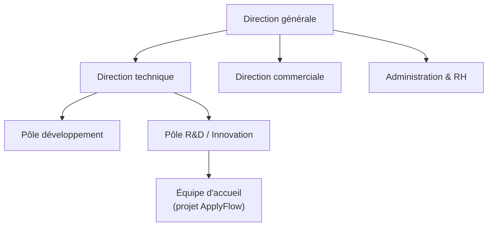
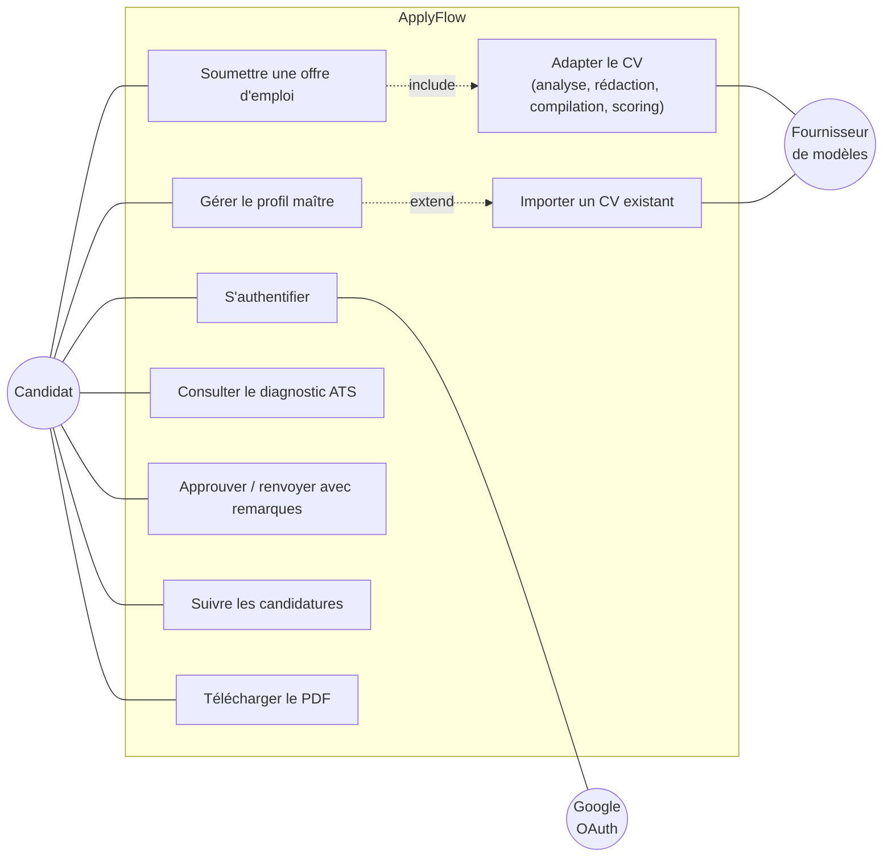
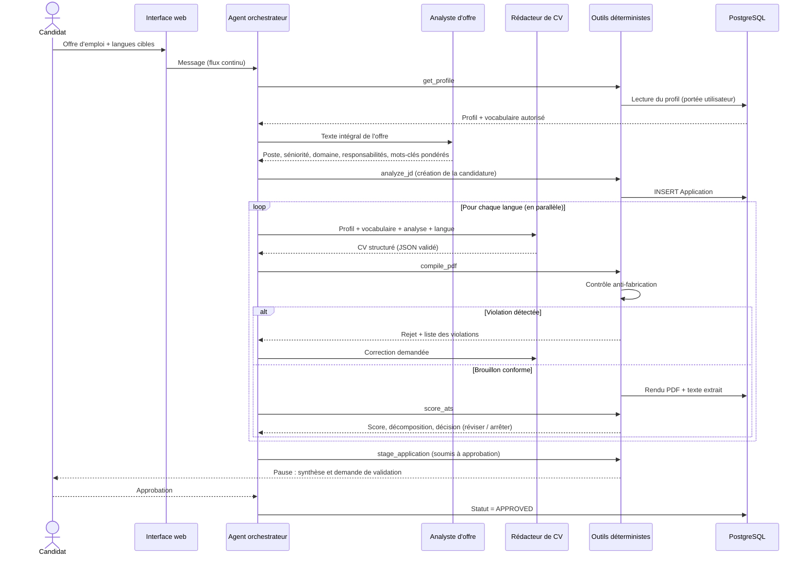
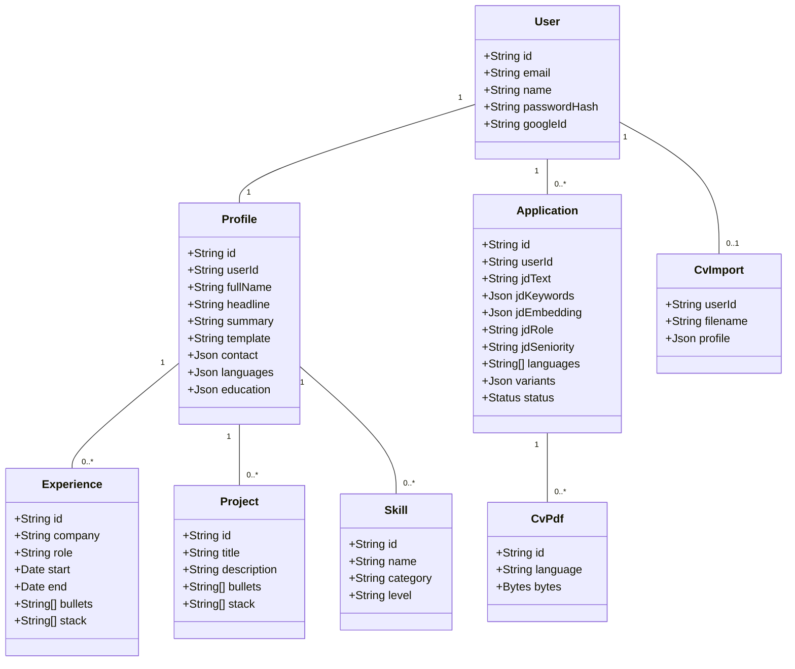
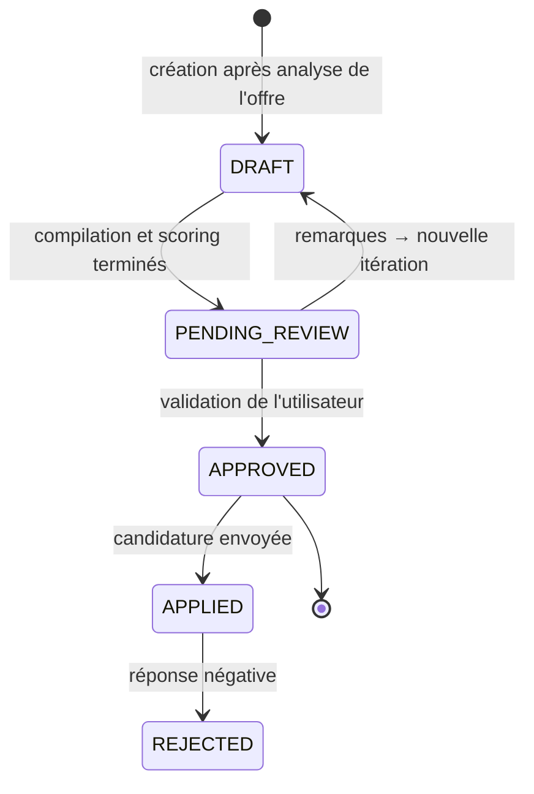
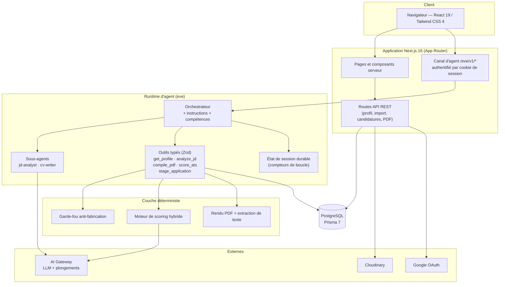
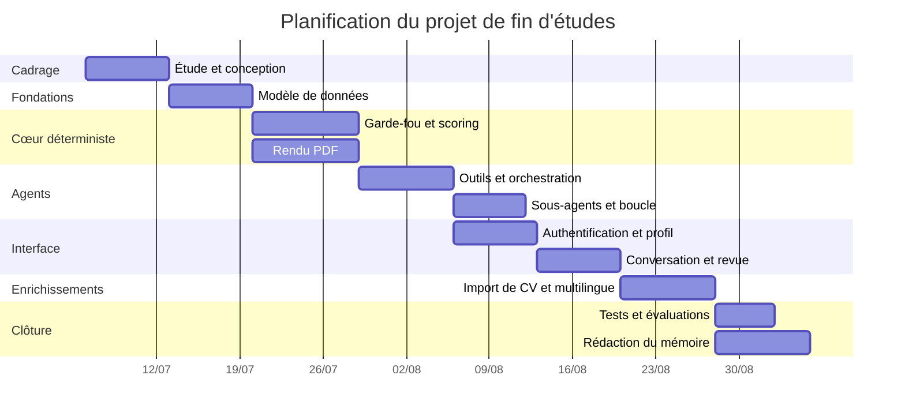

# Mémoire de projet de fin d'études

**Conception et réalisation d'un agent IA multi-agents pour l'adaptation automatisée de CV aux offres d'emploi — la plateforme *ApplyFlow***

---

| | |
|---|---|
| **Étudiant** | Youness Hassoune |
| **Établissement** | *[Nom de l'école / université — filière]* |
| **Organisme d'accueil (le cas échéant)** | *[Nom de l'entreprise]* |
| **Encadrant professionnel** | *[Nom, fonction]* |
| **Encadrant pédagogique** | *[Nom, fonction]* |
| **Période du projet** | *[jj/mm/aaaa] – [jj/mm/aaaa]* |
| **Année universitaire** | *[20xx – 20xx]* |

> **Note de rédaction.** Ce document est une base de travail complète et cohérente. Les éléments qui ne peuvent être déduits du projet lui-même — nom de l'organisme d'accueil, organigramme, dates exactes, noms des encadrants — sont signalés en *italique entre crochets* et doivent être renseignés dans la version finale. Tout le contenu technique (architecture, modèle de données, algorithmes, technologies, tests) est fidèle au code réellement produit.

---

## Table des matières

- [Résumé](#résumé)
- [Abstract](#abstract)
- [Introduction générale](#introduction-générale)
- [Chapitre I : Contexte général du projet](#chapitre-i--contexte-général-du-projet)
- [Chapitre II : Étude et analyse du projet](#chapitre-ii--étude-et-analyse-du-projet)
- [Chapitre III : Réalisation](#chapitre-iii--réalisation)
- [Conclusion et perspectives](#conclusion-et-perspectives)
- [Bibliographie](#bibliographie)
- [Webographie](#webographie)

---

## Résumé

Le recrutement contemporain est massivement médiatisé par des logiciels de suivi des candidatures (*Applicant Tracking Systems*, ATS), qui filtrent, indexent et classent les CV avant toute lecture humaine. Un candidat compétent peut ainsi être écarté non pour un défaut de qualification, mais parce que son CV — rédigé une fois pour toutes et envoyé tel quel à des dizaines d'offres — ne parle pas le vocabulaire de l'annonce. Adapter manuellement un CV à chaque offre est en revanche une tâche coûteuse, répétitive et sujette à deux dérives symétriques : le bourrage de mots-clés et l'invention pure et simple de compétences.

Le présent travail, mené au sein de *[l'organisme d'accueil]*, a consisté à concevoir et réaliser **ApplyFlow**, une application web pilotée par un système multi-agents fondé sur les grands modèles de langage (LLM). L'utilisateur maintient un **profil maître** unique — sa vérité factuelle — puis colle une offre d'emploi. Un agent orchestrateur coordonne alors deux sous-agents spécialisés : un **analyste d'offre** qui extrait sémantiquement le poste, la séniorité, le domaine, les responsabilités et une liste de mots-clés pondérés ; et un **rédacteur de CV** qui produit, par langue cible, un CV structuré adapté au poste. Le document est ensuite validé par un **garde-fou anti-fabrication** déterministe, compilé en PDF compatible ATS, puis noté par un **moteur de scoring hybride** (mots-clés pondérés 35 %, similarité sémantique par plongements vectoriels 35 %, structure et quantification 15 %, adéquation titre/ancienneté 15 %, le tout multiplié par un facteur de passage sur les compétences indispensables). Le score déclenche une **boucle d'auto-correction bornée** qui s'arrête au plafond honnête du profil, puis la candidature est soumise à la **validation explicite de l'utilisateur** avant tout usage.

La solution a été implémentée en TypeScript sur une pile Next.js 16 / React 19 / Tailwind CSS 4 pour l'interface, le framework d'agents *eve* pour le runtime conversationnel durable, Prisma 7 et PostgreSQL pour la persistance, et `@react-pdf/renderer` pour la génération documentaire. La chaîne déterministe (garde-fou → rendu PDF → extraction de texte → scoring) est couverte par une campagne de vérification hors-ligne, complétée par des tests unitaires ciblés et une évaluation de bout en bout du parcours de l'agent.

**Mots-clés :** agents IA, LLM, système multi-agents, ATS, génération de CV, plongements vectoriels, Next.js, TypeScript, Prisma, PostgreSQL, human-in-the-loop, anti-hallucination.

---

## Abstract

Modern hiring is largely mediated by Applicant Tracking Systems (ATS), which parse, index and rank résumés before any human reads them. A qualified candidate can therefore be filtered out not for lack of skill, but because a single, generic CV sent to dozens of openings does not speak the vocabulary of the posting. Tailoring a CV by hand for every application is, however, slow, repetitive work that invites two symmetrical failure modes: keyword stuffing and outright fabrication of experience.

This project, carried out at *[the host company]*, delivers **ApplyFlow**, a web application driven by an LLM-based multi-agent system. The user maintains a single **master profile** — the factual source of truth — and then pastes a job description. An orchestrating agent coordinates two specialised sub-agents: a **JD analyst** that semantically extracts the role, seniority, domain, responsibilities and a set of weighted ATS keywords; and a **CV writer** that produces, per target language, a structured CV adapted to the role. The draft is then checked by a deterministic **anti-fabrication guard**, compiled into an ATS-friendly PDF, and graded by a **hybrid scoring engine** (weighted keywords 35 %, embedding-based semantic similarity 35 %, structure and quantified achievements 15 %, title/years fit 15 %, all multiplied by a must-have coverage gate). The score drives a **bounded self-healing loop** that stops at the profile's honest ceiling, after which the application is submitted for **explicit human approval**.

The system is implemented in TypeScript on a Next.js 16 / React 19 / Tailwind CSS 4 front end, the *eve* agent framework for durable conversational runtime, Prisma 7 with PostgreSQL for persistence, and `@react-pdf/renderer` for document generation. The deterministic half of the pipeline (guard → PDF render → text extraction → scoring) is covered by an offline verification suite, supplemented by targeted unit tests and an end-to-end evaluation of the agent workflow.

**Keywords:** AI agents, LLM, multi-agent system, ATS, résumé generation, embeddings, Next.js, TypeScript, Prisma, PostgreSQL, human-in-the-loop, anti-hallucination.

---

## Introduction générale

L'accès à l'emploi qualifié s'est profondément industrialisé au cours de la dernière décennie. Les grandes entreprises, mais aussi un nombre croissant de PME et de cabinets de recrutement, s'appuient sur des systèmes de suivi des candidatures (ATS) pour centraliser, analyser et hiérarchiser les candidatures reçues. Ces outils lisent le CV comme une donnée : ils en extraient des champs structurés, comparent le texte au descriptif de poste, attribuent un score de correspondance et présentent au recruteur une liste ordonnée. Le premier lecteur d'un CV n'est donc plus un humain, mais un programme.

Cette médiation logicielle change la nature de l'exercice. Un CV n'est plus seulement un document de présentation : c'est aussi un objet à indexer, dont la structure, le vocabulaire et la mise en forme conditionnent la visibilité. Un candidat dont l'expérience correspond réellement au poste peut être écarté parce que son document emploie « développement d'API REST » là où l'annonce dit « microservices », parce que son intitulé de poste ne recoupe pas celui recherché, ou parce qu'une mise en page en colonnes empêche l'extraction correcte du texte.

La réponse intuitive — adapter le CV à chaque offre — se heurte à un mur pratique. Le travail est long, il doit être répété pour chaque candidature et, s'il est confié sans garde-fou à un modèle de langage généraliste, il produit rapidement des documents flatteurs mais faux : compétences jamais pratiquées, employeurs approximatifs, chiffres inventés. Or un CV est un document engageant : la fabrication n'y est pas une imperfection stylistique, c'est une faute.

C'est à cette tension que répond le projet mené dans le cadre de ce projet de fin d'études. L'objectif n'est pas de « générer un CV », mais de **réécrire, sous contrainte de véracité, une expérience réelle dans le langage d'une offre donnée**, tout en mesurant objectivement le résultat et en rendant la mesure exploitable. Trois convictions ont structuré la conception :

1. **La vérité est une donnée, pas une consigne.** Le profil maître de l'utilisateur, stocké en base, est l'unique source des faits. Les employeurs, les intitulés, les dates et les projets n'y sont jamais altérés par le modèle ; un contrôle déterministe rejette toute compilation qui s'en écarte.
2. **La mesure doit être déterministe.** Faire noter un CV par un LLM revient à demander à l'auteur d'être son propre correcteur. Le score est donc calculé par un moteur explicite et reproductible, dont chaque composante est traçable.
3. **La décision finale revient à l'humain.** L'agent prépare, argumente et signale ce qu'il n'a pas pu affirmer honnêtement ; il ne finalise rien sans validation explicite.

Ce rapport rend compte de l'ensemble de la démarche. Le **premier chapitre** situe le contexte : l'organisme d'accueil, la problématique métier, les objectifs assignés au projet et le périmètre retenu. Le **deuxième chapitre** présente l'étude et l'analyse : état de l'art des solutions existantes et leur critique, expression des besoins fonctionnels et non fonctionnels, modélisation UML, choix d'architecture et justification des technologies, ainsi que la méthodologie et la planification adoptées. Le **troisième chapitre** détaille la réalisation : environnement de travail, mise en œuvre de la couche de données, du système multi-agents, du moteur de scoring, de la génération PDF, de l'interface utilisateur et de la stratégie de tests, illustrée par les principales interfaces produites. La **conclusion** dresse le bilan technique et personnel du projet et ouvre sur les perspectives d'évolution du produit.

---

## Chapitre I : Contexte général du projet

### I.1. Introduction du chapitre

Ce chapitre pose le cadre du travail réalisé. Il présente successivement l'organisme d'accueil et son activité, la problématique métier à laquelle le projet répond, l'analyse critique de la situation existante, les objectifs fixés, le périmètre fonctionnel retenu et les contraintes qui ont pesé sur les choix de conception.

### I.2. Présentation de l'organisme d'accueil

#### I.2.1. Fiche signalétique

| Élément | Information |
|---|---|
| Raison sociale | *[Nom de l'entreprise]* |
| Forme juridique | *[SARL / SA / Startup …]* |
| Date de création | *[Année]* |
| Secteur d'activité | *[Édition logicielle / ESN / Conseil …]* |
| Effectif | *[Nombre de collaborateurs]* |
| Siège social | *[Adresse, ville]* |
| Site web | *[URL]* |

#### I.2.2. Activités et positionnement

*[Décrire en un ou deux paragraphes l'activité de l'entreprise : domaines d'intervention, typologie de clients, produits ou services phares, positionnement sur le marché. Si le stage s'est déroulé dans une structure orientée produit ou dans un contexte d'innovation interne, préciser le rattachement du projet à cette stratégie — par exemple : exploration des usages de l'IA générative appliquée aux ressources humaines.]*

#### I.2.3. Organisation et équipe d'accueil

*[Présenter l'organigramme simplifié et situer l'équipe d'accueil : département technique, cellule R&D, équipe produit. Préciser la composition de l'équipe au sein de laquelle le stage s'est déroulé et le rôle de l'encadrant professionnel.]*



*Figure 1 — Organigramme simplifié de l'organisme d'accueil (à adapter).*

### I.3. Contexte et problématique

#### I.3.1. Le filtrage algorithmique des candidatures

Un ATS est un logiciel de gestion du cycle de recrutement. Sa fonction première est administrative — centraliser les candidatures, suivre leur statut, coordonner les entretiens — mais il embarque presque toujours une chaîne d'analyse documentaire en trois temps :

1. **L'analyse syntaxique (*parsing*).** Le fichier reçu est converti en texte, puis découpé en champs structurés : identité, coordonnées, expériences, formations, compétences. Cette étape est fragile : les mises en page multi-colonnes, les tableaux, les zones de texte, les icônes et les photographies dégradent l'extraction, quand ils ne la font pas échouer.
2. **Le filtrage par mots-clés.** Le texte extrait est confronté aux exigences de l'offre. Les compétences indispensables agissent en pratique comme des filtres éliminatoires : leur absence écarte le dossier indépendamment de la qualité du reste.
3. **Le classement.** Les candidatures retenues sont ordonnées selon un score de correspondance, calculé sur le recouvrement lexical et, dans les systèmes récents, sur une similarité sémantique apprise.

Il en découle une conséquence opérationnelle simple : **un CV pertinent mais mal aligné lexicalement et structurellement sur l'offre est invisible**, quelles que soient les compétences réelles du candidat.

#### I.3.2. Le coût de l'adaptation manuelle

L'adaptation d'un CV à une offre suppose de lire l'annonce, d'en dégager les attendus réels, de réordonner les expériences, de reformuler les réalisations dans le vocabulaire du poste, de recompiler le document et — pour les candidatures internationales — de recommencer dans une autre langue. À raison de vingt à quarante minutes par offre, le candidat qui postule sérieusement à quinze annonces y consacre une journée pleine de travail non créatif. En pratique, il y renonce et envoie un document générique.

#### I.3.3. Les limites de la génération non contrainte

Confier cette adaptation à un assistant conversationnel généraliste déplace le problème sans le résoudre. Trois écueils apparaissent systématiquement :

- **La fabrication.** Le modèle, optimisé pour satisfaire la demande, ajoute les technologies mentionnées dans l'annonce même lorsque le candidat ne les a jamais pratiquées, invente des chiffres de performance, arrondit des dates ou reformule un intitulé de poste au-delà du vrai.
- **L'absence de mesure.** Rien ne permet de savoir si le document produit est *effectivement* mieux aligné que le précédent. Le modèle affirme qu'il a amélioré le CV ; c'est une assertion, pas une mesure.
- **La perte de la structure.** Le résultat est un texte, pas un document : il faut ensuite le remettre en forme, ce qui réintroduit le risque d'une mise en page hostile aux analyseurs.

#### I.3.4. Formulation de la problématique

> **Comment automatiser l'adaptation d'un CV à une offre d'emploi de manière à maximiser sa lisibilité par les systèmes ATS et sa pertinence perçue par un recruteur, tout en garantissant par construction qu'aucune information non véridique n'est introduite, et en maintenant l'utilisateur en position de décision finale ?**

Cette formulation contient trois exigences de nature différente, dont l'articulation constitue la difficulté centrale du projet :

- une exigence **d'optimisation** (maximiser l'alignement) ;
- une exigence **de véracité** (ne rien inventer), garantie qui ne peut être confiée au modèle lui-même ;
- une exigence **de gouvernance** (l'humain décide), qui impose une interruption contrôlée du flux automatique.

### I.4. Étude critique de l'existant

Deux situations de référence ont été analysées.

**Le processus manuel du candidat.** Il est fiable quant à la véracité — le candidat sait ce qu'il a fait — mais coûteux, non reproductible et aveugle : le candidat ne dispose d'aucun retour objectif sur l'alignement de son document avec l'annonce, et découvre le résultat sous la forme d'une absence de réponse.

**L'usage d'un assistant conversationnel généraliste.** Il est rapide et produit un texte de bonne facture, mais ne garantit ni la véracité, ni la structure, ni la mesure, et n'offre aucune persistance : chaque candidature repart de zéro, sans mémoire du profil ni historique.

Une analyse des solutions commerciales du marché (Jobscan, Teal, Rezi, Kickresume) est développée au chapitre II, section II.2, où elle sert directement à positionner les choix de conception.

### I.5. Objectifs du projet

L'objectif général est de **concevoir et développer une application web complète intégrant un système multi-agents capable d'adapter, de compiler, d'évaluer et de faire valider un CV à partir d'une offre d'emploi et d'un profil maître véridique.**

Il se décline en objectifs spécifiques :

| N° | Objectif spécifique | Critère de réussite |
|---|---|---|
| O1 | Modéliser et persister un profil maître structuré (expériences, projets, compétences, formations, langues) | Schéma relationnel migré, CRUD opérationnel |
| O2 | Permettre l'alimentation du profil par import d'un CV existant (PDF/DOCX) | Extraction structurée validée par schéma, appliquée après revue de l'utilisateur |
| O3 | Analyser sémantiquement une offre d'emploi (poste, séniorité, domaine, responsabilités, mots-clés pondérés) | Sortie structurée conforme au schéma |
| O4 | Générer un CV adapté par langue cible, sans fabrication | Aucune violation du garde-fou en sortie de boucle |
| O5 | Compiler un PDF lisible par les analyseurs ATS | Texte ré-extrait du PDF exploitable par le moteur de scoring |
| O6 | Évaluer le CV par un score déterministe et explicable | Score reproductible, décomposé en composantes |
| O7 | Faire converger le CV par une boucle d'auto-correction bornée | Arrêt garanti : cible atteinte, plafond, plateau ou budget épuisé |
| O8 | Soumettre le résultat à validation humaine explicite | Aucune finalisation sans approbation utilisateur |
| O9 | Offrir une interface de suivi des candidatures et de revue | Liste des candidatures, espace de revue avec aperçu PDF et diagnostic |
| O10 | Sécuriser l'accès et cloisonner les données par utilisateur | Authentification, portée par utilisateur sur chaque accès en base |

### I.6. Périmètre du projet

**Inclus dans le périmètre :**

- Authentification par courriel/mot de passe et par Google OAuth 2.0 ;
- Éditeur de profil maître et import d'un CV existant ;
- Conversation avec l'agent, avec reprise de session durable ;
- Analyse d'offre, rédaction multilingue, compilation PDF, scoring, boucle d'auto-correction, validation humaine ;
- Historique des candidatures, cycle de vie de statut, espace de revue avec aperçu du document et diagnostic détaillé ;
- Choix parmi plusieurs modèles de mise en page, tous compatibles ATS.

**Hors périmètre (justifié) :**

- La génération de lettres de motivation, écartée pour concentrer l'effort sur la qualité du cœur métier ;
- La soumission automatique des candidatures aux plateformes d'emploi, qui pose des problèmes de conformité aux conditions d'utilisation de ces plateformes ;
- L'application mobile native, l'interface web étant conçue pour être adaptative ;
- La collecte automatisée d'offres (*scraping*), pour les mêmes raisons de conformité.

### I.7. Contraintes du projet

| Type | Contrainte | Incidence sur la conception |
|---|---|---|
| Technique | Non-déterminisme intrinsèque des LLM | Toute garantie forte est déportée dans du code déterministe (garde-fou, scoring, bornes de boucle) |
| Technique | Coût et latence des appels aux modèles | Hiérarchie de modèles par tâche, idempotence des outils, mise en cache des plongements vectoriels |
| Technique | Fragilité des analyseurs ATS | Mise en page mono-colonne imposée, absence de photographie dans le PDF compilé, titres de sections normalisés |
| Éthique et juridique | Véracité du document produit ; données personnelles | Garde-fou anti-fabrication, signalement explicite des affirmations non couvertes par le profil, cloisonnement strict par utilisateur |
| Organisationnelle | Durée limitée du projet | Découpage en incréments livrables, priorisation MoSCoW |

### I.8. Conclusion du chapitre

Ce chapitre a montré que la difficulté du problème ne réside pas dans la génération de texte — les modèles actuels y excellent — mais dans l'encadrement de cette génération : garantir la véracité, mesurer objectivement le résultat et borner un processus itératif par nature ouvert. Le chapitre suivant traduit ces constats en besoins formalisés, en modèles et en choix d'architecture.

---

## Chapitre II : Étude et analyse du projet

### II.1. Introduction du chapitre

Ce chapitre traduit la problématique en une solution spécifiée. Il compare d'abord les solutions existantes, formalise ensuite les besoins fonctionnels et non fonctionnels, présente la modélisation UML du système, puis justifie l'architecture retenue et les technologies choisies. Il se termine par la méthodologie de travail et la planification.

### II.2. Étude de l'existant et analyse comparative

| Solution | Principe | Apports | Limites au regard de notre problématique |
|---|---|---|---|
| **Jobscan** | Comparaison CV / offre, score de correspondance | Diagnostic ATS de qualité, recommandations de mots-clés | Analyse seulement : n'écrit pas le CV, ne le compile pas, laisse la réécriture à l'utilisateur |
| **Teal** | Suivi de candidatures + assistant de rédaction | Bonne gestion du pipeline de candidatures | Adaptation surtout manuelle et assistée ; pas de boucle de convergence mesurée |
| **Rezi / Kickresume** | Éditeur de CV avec génération IA de contenu | Modèles soignés, génération de puces rapide | Aucun garde-fou de véracité : le contenu généré n'est pas confronté à une source de vérité persistante |
| **Assistant conversationnel généraliste** | Rédaction libre par LLM | Souplesse maximale, coût nul | Fabrication non contrôlée, absence de mesure, absence de document compilé et de persistance |
| **Processus manuel** | Réécriture par le candidat | Véracité garantie | Coût élevé, non reproductible, sans retour objectif |

**Synthèse.** Le marché se partage entre des outils qui *mesurent* sans écrire et des outils qui *écrivent* sans mesurer ni vérifier. Aucun ne referme la boucle « analyser → écrire → compiler → mesurer → corriger → faire valider » sur une source de vérité persistante. C'est précisément l'espace occupé par ApplyFlow.

### II.3. Solution proposée

ApplyFlow articule cinq principes de conception :

1. **Profil maître unique.** Un enregistrement relationnel par utilisateur concentre les faits : expériences (employeur, intitulé, dates, réalisations, technologies effectivement utilisées), projets, compétences, formations, langues. Rien d'autre ne peut devenir un fait dans un CV.
2. **Spécialisation multi-agents.** Un orchestrateur pilote le déroulé ; un analyste d'offre fait de l'extraction structurée ; un rédacteur produit le CV. Chaque rôle reçoit un modèle dimensionné pour sa tâche, ce qui améliore à la fois la fiabilité et le coût.
3. **Vérification déterministe hors du modèle.** Le contrôle anti-fabrication et le calcul du score sont du code, pas des consignes de *prompt*.
4. **Boucle d'amélioration bornée et informée.** L'itération s'arrête sur une décision calculée (cible atteinte, plafond honnête du profil, plateau de progression, budget épuisé), jamais sur l'appréciation du modèle.
5. **Validation humaine obligatoire.** La finalisation est un outil soumis à approbation : l'exécution se met en pause et attend l'utilisateur.

### II.4. Analyse et spécification des besoins

#### II.4.1. Acteurs du système

| Acteur | Nature | Rôle |
|---|---|---|
| **Candidat (utilisateur)** | Humain, principal | Gère son profil, soumet des offres, arbitre et valide les candidatures |
| **Agent orchestrateur** | Système | Coordonne le déroulé, appelle les outils et les sous-agents |
| **Sous-agent analyste d'offre** | Système | Extraction sémantique structurée de l'annonce |
| **Sous-agent rédacteur** | Système | Rédaction d'un CV par langue cible |
| **Fournisseur de modèles (AI Gateway)** | Externe | Inférence LLM et calcul des plongements vectoriels |
| **Fournisseur d'identité Google** | Externe | Authentification OAuth 2.0 |
| **Service de médias (Cloudinary)** | Externe | Stockage de la photographie de profil |

#### II.4.2. Besoins fonctionnels

| Réf. | Besoin | Priorité (MoSCoW) |
|---|---|---|
| BF-01 | Créer un compte, se connecter par mot de passe ou via Google | Must |
| BF-02 | Créer et modifier le profil maître (identité, contact, expériences, projets, compétences, formations, langues) | Must |
| BF-03 | Importer un CV existant (PDF/DOCX) et pré-remplir le profil après revue | Should |
| BF-04 | Soumettre une offre d'emploi et une ou plusieurs langues cibles à l'agent | Must |
| BF-05 | Obtenir l'analyse de l'offre : poste, séniorité, domaine, profil recherché, responsabilités, mots-clés pondérés | Must |
| BF-06 | Générer un CV adapté par langue, à partir du seul profil maître | Must |
| BF-07 | Compiler le CV en PDF compatible ATS, selon un modèle de mise en page au choix | Must |
| BF-08 | Obtenir un score ATS détaillé et des recommandations exploitables | Must |
| BF-09 | Déclencher automatiquement les révisions tant qu'elles sont utiles, dans une limite fixée | Must |
| BF-10 | Approuver ou renvoyer la candidature avec des remarques | Must |
| BF-11 | Consulter l'historique des candidatures et leur statut | Must |
| BF-12 | Visualiser le PDF, le diagnostic et la conversation dans un espace de revue | Should |
| BF-13 | Télécharger le PDF de chaque variante linguistique | Must |
| BF-14 | Reprendre une conversation interrompue sans perte | Should |
| BF-15 | Gérer les paramètres du compte (mot de passe, thème, suppression) | Could |

#### II.4.3. Besoins non fonctionnels

| Réf. | Catégorie | Exigence |
|---|---|---|
| BNF-01 | **Véracité** | Aucun employeur, intitulé, date ou projet absent du profil ne peut apparaître dans un CV compilé ; toute compétence affirmée hors profil est signalée à l'utilisateur |
| BNF-02 | **Déterminisme** | Le score doit être reproductible à l'identique pour un même couple (CV, offre) |
| BNF-03 | **Sécurité** | Session signée cryptographiquement, mots de passe hachés avec sel, portée par utilisateur appliquée sur chaque requête en base |
| BNF-04 | **Robustesse** | Toute défaillance d'un service externe doit être dégradée proprement, jamais silencieusement fausse |
| BNF-05 | **Maîtrise des coûts** | Idempotence des outils, mise en cache du plongement de l'offre, plafonnement du nombre d'itérations et de rejets |
| BNF-06 | **Performance perçue** | Retour d'avancement en flux continu pendant le traitement ; reprise possible après rechargement de la page |
| BNF-07 | **Utilisabilité** | Interface adaptative, thèmes clair et sombre, aucun identifiant technique exposé à l'utilisateur |
| BNF-08 | **Maintenabilité** | Typage strict de bout en bout, schémas de validation partagés entre l'agent et l'interface |
| BNF-09 | **Portabilité** | Même moteur de base de données en développement et en production ; démarrage local par conteneur |

#### II.4.4. Diagramme de cas d'utilisation



*Figure 2 — Diagramme de cas d'utilisation.*

#### II.4.5. Description textuelle du cas d'utilisation central

| Rubrique | Contenu |
|---|---|
| **Nom** | Adapter le CV à une offre d'emploi |
| **Acteur principal** | Candidat |
| **Préconditions** | L'utilisateur est authentifié et son profil maître est renseigné |
| **Scénario nominal** | 1. L'utilisateur colle l'offre et précise les langues cibles. 2. L'agent charge le profil maître. 3. L'analyste d'offre en extrait le poste, la séniorité, le domaine, les responsabilités et les mots-clés pondérés. 4. Une candidature unique est créée pour cette offre. 5. Pour chaque langue, le rédacteur produit un CV. 6. Le CV est vérifié puis compilé en PDF. 7. Le PDF est ré-extrait en texte et noté. 8. Tant que la décision calculée vaut « réviser », le rédacteur reprend sa copie. 9. L'agent soumet la candidature à validation avec une synthèse honnête. 10. L'utilisateur approuve. |
| **Scénarios alternatifs** | 3a. L'analyse échoue : une nouvelle tentative est faite ; après deux échecs, le traitement s'arrête avec un message explicite. 6a. Le contrôle rejette le brouillon : les violations sont renvoyées au rédacteur (au plus trois fois). 8a. Le score plafonne : la boucle s'arrête et l'écart est signalé. 10a. L'utilisateur répond par des remarques : la boucle reprend pour les langues concernées. |
| **Postconditions** | Une candidature approuvée, une ou plusieurs variantes linguistiques compilées, un rapport de score par variante |

#### II.4.6. Diagramme de séquence du parcours d'adaptation



*Figure 3 — Diagramme de séquence du parcours principal.*

#### II.4.7. Diagramme de classes du domaine



*Figure 4 — Diagramme de classes du domaine.*

#### II.4.8. Cycle de vie d'une candidature



*Figure 5 — Diagramme d'états du statut de candidature.*

### II.5. Architecture logicielle

#### II.5.1. Vue d'ensemble

L'application est déployée comme un ensemble cohérent : l'interface Next.js et le runtime d'agent partagent le même dépôt, la même origine HTTP et la même base de données, ce qui supprime les problèmes d'origines croisées et de synchronisation de session.



*Figure 6 — Architecture générale de la solution.*

#### II.5.2. Justification des choix d'architecture

**Pourquoi un système multi-agents plutôt qu'un modèle unique ?** Les trois tâches n'ont ni le même profil de risque ni le même coût. L'extraction d'annonce est une tâche courte, structurée, sans délibération : elle est confiée à un modèle rapide en mode raisonnement minimal. La rédaction demande de la qualité d'écriture et une sortie strictement conforme au schéma. L'orchestration, elle, ne rédige rien : elle est évaluée sur sa discipline d'appel d'outils. Séparer ces rôles permet d'affecter à chacun le modèle adéquat par simple variable d'environnement, sans toucher au code, et isole les défaillances : un échec d'extraction est détecté et rejoué sans remettre en cause la rédaction.

**Pourquoi PostgreSQL plutôt qu'une base documentaire ?** Le domaine est franchement relationnel : le profil possède des expériences, des projets et des compétences par clés étrangères, et la candidature suit un cycle de statut. Les migrations et les requêtes relationnelles de Prisma sont de première classe sur PostgreSQL, tandis que les champs souples (contact, mots-clés, rapport de score, variantes linguistiques) trouvent leur place dans des colonnes `Json`. Enfin, l'image `pgvector` utilisée en développement ouvre la voie à un stockage vectoriel natif sans changer de moteur.

**Pourquoi déporter les garanties dans du code déterministe ?** Une consigne de *prompt* est une préférence statistique, pas une garantie. Le contrôle anti-fabrication et le calcul du score sont donc des fonctions pures, testables hors ligne, exécutées avant toute persistance : le modèle ne peut pas contourner ce qu'il ne contrôle pas.

**Pourquoi une validation humaine bloquante ?** Le CV engage l'utilisateur. L'outil de finalisation est déclaré comme requérant une approbation : le runtime suspend durablement l'exécution, présente la synthèse et n'écrit le statut final qu'après réponse.

### II.6. Choix technologiques

| Couche | Technologie | Version | Justification |
|---|---|---|---|
| Langage | TypeScript | 6.x | Typage strict de bout en bout, des schémas de base jusqu'aux composants |
| Interface | Next.js (App Router) + React | 16 / 19 | Rendu serveur, routes API et interface dans un même déploiement ; composants serveur pour les lectures de données |
| Styles | Tailwind CSS | 4 | Système utilitaire, thèmes clair/sombre par variables CSS |
| Composants | shadcn/ui sur Base UI | — | Composants accessibles, possédés par le projet donc modifiables |
| Agents | eve | 0.31.x | Sessions durables, reprise de flux, approbations humaines, sous-agents et outils typés natifs |
| Modèles | Vercel AI Gateway (AI SDK) | ai 7.x | Un seul point d'accès pour plusieurs fournisseurs ; changement de modèle par configuration |
| Validation | Zod | 4 | Schémas partagés entre outils, sorties structurées et routes API |
| Persistance | Prisma + PostgreSQL | 7.x / 17 | Migrations versionnées, relations typées, colonnes JSON |
| PDF | @react-pdf/renderer | 4.x | Rendu déclaratif, contrôle total de la mise en page mono-colonne |
| Extraction | unpdf, mammoth | — | Lecture du texte des PDF et des documents Word à l'import |
| Médias | Cloudinary | — | Transformation et hébergement de la photographie de profil |
| Conteneurisation | Docker Compose | — | Base de données locale identique à la production |
| Déploiement | Vercel | — | Déploiement conjoint de l'interface et du runtime d'agent |

### II.7. Méthodologie et planification

#### II.7.1. Démarche

Le projet a été conduit de manière **agile et incrémentale**, par itérations d'environ une semaine, chacune close par un incrément fonctionnel démontrable et vérifié. Ce choix découle directement de la nature exploratoire du sujet : le comportement d'un système multi-agents ne se spécifie pas entièrement à l'avance, il s'observe et se corrige. La démarche s'est appuyée sur un plan d'implémentation écrit, un suivi par le contrôle de version, et une campagne de vérification hors-ligne rejouée à chaque incrément.

#### II.7.2. Découpage en phases

| Phase | Contenu | Durée indicative |
|---|---|---|
| **P0 — Cadrage** | État de l'art, analyse des besoins, choix technologiques, plan d'implémentation | *[1 semaine]* |
| **P1 — Fondations de données** | Schéma Prisma, migrations, base conteneurisée, jeu de données de démonstration | *[1 semaine]* |
| **P2 — Cœur déterministe** | Schéma de CV, garde-fou anti-fabrication, moteur de scoring, rendu PDF et extraction de texte | *[2 semaines]* |
| **P3 — Système d'agents** | Outils typés, instructions et compétences, sous-agents, boucle d'auto-correction, approbation humaine | *[2 semaines]* |
| **P4 — Interface** | Conversation, éditeur de profil, liste des candidatures, espace de revue, authentification | *[2 semaines]* |
| **P5 — Enrichissements** | Import de CV, variantes multilingues, modèles de mise en page, thèmes | *[1,5 semaine]* |
| **P6 — Vérification et rédaction** | Tests, évaluations, mise au point des modèles, rédaction du mémoire | *[1,5 semaine]* |

#### II.7.3. Diagramme de Gantt



*Figure 7 — Planification prévisionnelle (dates à ajuster).*

### II.8. Conclusion du chapitre

Les besoins ont été formalisés, la solution modélisée et l'architecture arrêtée autour d'un principe directeur : confier au modèle ce qu'il fait bien — comprendre et rédiger — et au code ce qu'il est seul à pouvoir garantir — vérifier, mesurer et borner. Le chapitre suivant décrit la mise en œuvre effective de cette architecture.

---

## Chapitre III : Réalisation

### III.1. Introduction du chapitre

Ce chapitre présente la concrétisation de la solution : environnement et outils de travail, organisation du code, puis mise en œuvre détaillée de chaque brique — couche de données, garde-fou, moteur de scoring, génération PDF, système d'agents, interface — avant d'exposer la stratégie de tests et les résultats obtenus.

### III.2. Environnement de travail

#### III.2.1. Environnement matériel

*[Poste de développement : processeur, mémoire vive, système d'exploitation. Exemple : ordinateur portable, 16 Go de RAM, Windows 11.]*

#### III.2.2. Environnement logiciel

| Catégorie | Outil |
|---|---|
| Éditeur | Visual Studio Code |
| Exécution | Node.js 24, gestionnaire de paquets pnpm |
| Base de données | PostgreSQL 17 via Docker Compose (image `pgvector`) |
| Exploration des données | Prisma Studio |
| Contrôle de version | Git |
| Modélisation | Diagrammes UML (Mermaid) |
| Conception d'interface | shadcn/ui, icônes Lucide |
| Déploiement | Vercel |

#### III.2.3. Organisation du code source

```
cv-agent/
├── agent/                  Runtime d'agent
│   ├── agent.ts            Définition de l'orchestrateur
│   ├── instructions.md     Identité, règles strictes, déroulé imposé
│   ├── channels/eve.ts     Politique d'authentification du canal
│   ├── skills/             Règles de rédaction et de mise en forme ATS
│   ├── subagents/          jd-analyst, cv-writer
│   ├── tools/              Outils typés exposés au modèle
│   └── lib/                ats.ts, guard.ts, cv-schema.ts, pdf.ts, state.ts…
├── app/                    Interface Next.js (App Router)
│   ├── (auth)/             Connexion, inscription
│   ├── (app)/              Conversation, candidatures, profil, paramètres
│   └── api/                Routes REST (profil, import, candidatures, PDF)
├── features/               Modules fonctionnels (conversation, accueil)
├── lib/                    Utilitaires partagés, modèles de mise en page
├── prisma/                 Schéma, migrations, jeux de données
├── evals/                  Évaluation de bout en bout de l'agent
└── scripts/                Vérification hors-ligne de la chaîne déterministe
```

### III.3. Mise en œuvre de la couche de données

Le schéma Prisma définit huit entités. Les choix notables :

- **Séparation des faits et des rendus.** Les faits vivent dans des colonnes typées (`Experience.start`, `Experience.stack`) ; les productions de l'agent vivent dans des colonnes `Json` (`variants`, `jdKeywords`, `atsReport`). Les premières sont la vérité, les secondes en sont des vues datées.
- **Une candidature par offre, plusieurs langues.** Le travail par langue est stocké dans `Application.variants`, indexé par code ISO, et les PDF binaires dans une table dédiée `CvPdf` : le JSON ne peut pas contenir d'octets, et un encodage base64 alourdirait chaque lecture de ligne.
- **Mise en cache du plongement de l'offre.** `Application.jdEmbedding` conserve le vecteur de l'annonce : les itérations suivantes ne recalculent que celui du CV, ce qui divise par deux le coût de plongement de la boucle.
- **Persistance de la conversation.** `chatEvents` et `chatSession` conservent le flux d'événements et le curseur de session, ce qui permet à l'espace de revue de reprendre exactement la conversation qui a produit la candidature.
- **Import en attente.** La table `CvImport` conserve le résultat d'un import de CV non encore appliqué : l'analyse a déjà coûté un appel modèle, un rechargement de page ne doit pas le gaspiller. Rien n'y est écrit dans le profil sans action explicite de l'utilisateur.

Huit migrations versionnées retracent l'évolution du schéma, depuis l'initialisation jusqu'à l'ajout des variantes multilingues et des champs d'analyse d'offre.

### III.4. Le garde-fou anti-fabrication

C'est la pièce qui rend la promesse de véracité opposable. Elle repose sur une distinction essentielle :

- **Les faits ne se négocient pas.** Employeurs et projets sont comparés au profil : tout nom absent provoque le rejet de la compilation.
- **Les compétences sont du vocabulaire, pas des faits.** Un profil n'est jamais un inventaire exhaustif : un développeur qui utilise React et Nest.js écrit manifestement du TypeScript, et le lui interdire coûterait une correspondance légitime sans gain d'honnêteté. Le vocabulaire autorisé est donc l'union des termes du profil et des mots-clés *demandés par cette offre*. Tout terme hors de cette union est une invention et provoque le rejet.
- **Toute affirmation non couverte par le profil est remontée.** Les termes acceptés au titre de l'offre mais absents du profil sont listés et présentés à l'utilisateur pour confirmation avant envoi : ils l'engagent, lui, et non ses données.

La fonction `allowedTerms` calcule ce vocabulaire et est transmise telle quelle au rédacteur : lui donner la liste en amont est ce qui rend les brouillons compilables du premier coup et évite des appels modèle inutiles.

### III.5. Le moteur de scoring ATS

#### III.5.1. Formule générale

Le score total combine quatre composantes, puis applique un facteur de passage :

```
base  = ( 0,35 · mots-clés + 0,35 · sémantique + 0,15 · structure + 0,15 · adéquation )
total = round( base × passage )
```

Toute composante indisponible — absence de fournisseur de plongements, offre ne mentionnant ni intitulé ni ancienneté — est retirée et les poids restants sont renormalisés. Un score n'est jamais accordé par défaut : l'absence de mesure n'est pas une note parfaite.

#### III.5.2. Composante mots-clés (35 %)

Chaque mot-clé porte un poids de 1 (souhaité) à 3 (indispensable) et une catégorie. La correspondance n'est pas une comparaison de chaînes brutes :

- **Normalisation et découpage** conservant les formes techniques (`ci/cd`, `node.js`, `c++`, `c#`) ;
- **Désuffixation légère** appliquée des deux côtés, afin que « microservices » réponde à « microservice » et « managing » à « manage » ;
- **Forme déponctuée**, pour que `ci/cd`, `ci-cd` et `cicd` désignent la même compétence ;
- **Synonymes fournis par l'analyse de l'offre elle-même** (« Golang » pour « Go », « k8s » pour « Kubernetes »), car seule une lecture de l'annonce sait ce qu'un sigle y désigne ;
- **Correspondance par séquence contiguë**, pour qu'une expression de deux mots ne soit pas validée par deux occurrences éparses.

Un raffinement important : un terme trouvé **uniquement dans la liste de compétences** ne vaut que 60 % de son poids. Il est bien indexé par l'analyseur, mais un terme démontré dans une réalisation vaut davantage pour tout ce qui suit dans la chaîne de recrutement — et le crédit plein encouragerait le rédacteur à gonfler la liste pour gagner des points.

#### III.5.3. Composante sémantique (35 %)

Le texte de l'offre et le texte ré-extrait du PDF sont convertis en vecteurs par un modèle de plongement, et leur similarité cosinus est projetée sur une échelle de 0 à 100. Cette composante capte ce que le recouvrement lexical ignore : un CV qui parle du même métier avec d'autres mots. Le vecteur de l'offre est mis en cache dès le premier calcul.

#### III.5.4. Composante structure (15 %)

Trois vérifications : présence des titres de sections attendus (40 points), proportion de réalisations quantifiées (40 points, plein crédit à partir de 40 % de lignes portant un nombre), longueur du document dans une fourchette raisonnable de 300 à 1100 mots (20 points). Le détecteur de quantification neutralise d'abord les dates, faute de quoi « 2021 – 2023 » se lirait comme une performance chiffrée.

#### III.5.5. Composante adéquation (15 %)

Elle modélise les filtres structurés qu'un ATS applique avant toute analyse de texte : le recouvrement entre le titre visé et les intitulés portés par le CV (60 %), et le rapport entre l'ancienneté demandée par l'annonce et celle calculée à partir des dates réelles du profil, chevauchements comptés une seule fois (40 %).

#### III.5.6. Facteur de passage et plafond honnête

Les compétences indispensables ne sont pas moyennées mais **multiplicatives** : le score est multiplié par la proportion de compétences de poids 3 effectivement présentes. Un excellent score sémantique ne peut donc pas compenser l'absence d'une exigence bloquante. Le facteur est exprimé en proportion, et non par une mise à zéro, afin que la boucle de révision puisse constater qu'elle se rapproche. Les compétences comportementales sont exclues du filtre : aucun système ne rejette un CV parce qu'il ne contient pas le mot « collaboration ».

Le moteur calcule enfin un **plafond** : le meilleur score que ce profil pourrait atteindre pour cette offre si chaque révision réussissait, compte tenu des mots-clés que le profil ne peut tout simplement pas soutenir. C'est l'information qui empêche la boucle de dépenser quatre appels modèle pour découvrir qu'une exigence est hors de portée.

#### III.5.7. Décision d'arrêt

La décision de poursuivre ou d'arrêter est calculée par du code, jamais laissée à l'appréciation du modèle. Quatre motifs d'arrêt :

| Motif | Condition |
|---|---|
| Cible atteinte | Le score atteint l'objectif fixé (90) |
| Plafond honnête atteint | Le score est à moins de 3 points de ce que le profil permet de revendiquer sincèrement |
| Plateau | La dernière révision a fait progresser le score de moins de 2 points : les suivantes réorganisent sans améliorer |
| Budget épuisé | Le quota de compilations pour cette langue est consommé |

### III.6. Génération du document PDF

Le rendu est déclaratif, en mise en page **mono-colonne** — la seule que les analyseurs traitent de façon fiable — avec des titres de sections normalisés et traduits selon la langue cible, une typographie sans effet exotique et **aucune photographie dans le document compilé**, alors même que l'interface en affiche une dans l'aperçu du profil. Trois modèles (*Modern*, *Classic*, *Compact*) font varier les tailles, les graisses et les espacements sans jamais compromettre l'extraction.

Point de conception notable : le texte noté n'est pas le JSON du CV mais **le texte ré-extrait du PDF produit**. C'est exactement ce qu'un ATS lira. Cela a révélé un artefact réel : les titres de sections à interlettrage élargi sont restitués sous la forme « S K I L L S » ; une règle de recollage a donc été ajoutée au moteur pour que la détection des sections ne soit pas mise en échec par un choix typographique.

### III.7. Le système multi-agents

#### III.7.1. Les outils exposés au modèle

| Outil | Rôle | Particularité |
|---|---|---|
| `get_profile` | Charge le profil maître et le vocabulaire autorisé | Portée stricte par utilisateur |
| `analyze_jd` | Crée l'unique candidature de l'offre et persiste l'analyse | Idempotent : un second appel pour la même offre renvoie la candidature existante |
| `compile_pdf` | Valide, contrôle, rend le PDF et en ré-extrait le texte | Rejette les fabrications ; ne consomme pas d'itération pour un CV identique déjà compilé |
| `score_ats` | Note une variante et renvoie la décision d'arrêt | Idempotent : ne rejoue pas un calcul sur un texte inchangé |
| `stage_application` | Finalise la candidature | Soumis à approbation humaine obligatoire |

À ces outils métier s'ajoutent des outils génériques fournis par le framework (recherche et lecture de fichiers, recherche web, questions à l'utilisateur, liste de tâches).

#### III.7.2. Les sous-agents

**`jd-analyst`** est une strate d'extraction : pas d'outils, pas d'accès à la base, une seule sortie structurée conforme à un schéma exigeant. Le raisonnement y est réglé au minimum — l'annonce est sous les yeux du modèle et le schéma dit exactement quoi en extraire ; laisser un modèle délibérer sur cette tâche s'était révélé être l'étape la plus lente du parcours.

**`cv-writer`** rédige exactement un CV, dans exactement une langue, et renvoie du JSON validé. Il ne voit pas la conversation : l'orchestrateur doit lui transmettre dans son message tout ce dont il a besoin — profil complet, vocabulaire autorisé, analyse de l'offre, langue cible, et pour une révision le CV précédent accompagné de ce qu'il faut corriger. Le traitement multilingue consiste à émettre plusieurs appels en parallèle.

#### III.7.3. Le pilotage par instructions

Le fichier d'instructions de l'orchestrateur fixe l'identité, les règles strictes et le déroulé pas à pas. Sa règle directrice mérite d'être citée : **l'objectif est d'adapter le CV à l'offre, non de vérifier que les mots-clés y figurent déjà**. Une annonce orientée Java face à un candidat Node.js n'est pas un mauvais appariement par défaut : la conception d'API, l'architecture, les bases de données, l'authentification, les tests et le déploiement se transfèrent. Trois niveaux de confiance sont définis — expérience directe (à mettre en avant), compétence transférable (qui informe la formulation sans jamais être présentée comme une pratique directe), compétence absente (jamais ajoutée). Le score est explicitement désigné comme un signal interne d'optimisation, jamais comme l'objectif.

#### III.7.4. La boucle d'auto-correction et sa maîtrise

Un état de session durable maintient, par langue, le nombre de compilations réussies (plafonné à 4), le nombre de rejets du garde-fou (plafonné à 3, séparément, car un brouillon rejeté n'a jamais été rendu) et l'historique des scores servant à détecter le plateau. Ces compteurs survivent aux reprises de session et aux redémarrages à froid : la boucle reste bornée même en cas d'incident.

#### III.7.5. Sécurité et cloisonnement

Le canal de l'agent résout l'identité selon trois politiques successives : le cookie de session applicatif signé pour les utilisateurs du navigateur, l'identité de la plateforme de déploiement pour les outils internes, et un principal local en développement. Chaque outil résout l'identifiant utilisateur à partir de ce principal et l'ajoute à toutes ses requêtes : **l'agent ne peut structurellement atteindre que les données de l'utilisateur connecté**. Côté application, la session est un jeton signé en HMAC-SHA256, les mots de passe sont hachés avec sel, et la connexion Google suit le flux OAuth 2.0 standard.

### III.8. L'interface utilisateur

| Écran | Contenu |
|---|---|
| **Conversation** | Point d'entrée : dépôt de l'offre, suivi en flux continu de l'avancement, propositions d'amorces, rappel des travaux récents |
| **CV Builder (profil)** | Édition du profil maître, import d'un CV existant, photographie, choix du modèle de mise en page |
| **Candidatures** | Liste des candidatures avec poste, langues, score et statut |
| **Espace de revue** | Vue en trois volets : conversation reprise, aperçu du PDF par langue, diagnostic (mots-clés couverts, manquants, non revendiquables, recommandations) et actions de statut |
| **Paramètres** | Mot de passe, méthodes de connexion, thème, suppression du compte |

Deux exigences ont guidé l'interface. D'abord, **ne jamais exposer les rouages** : aucun identifiant technique, aucun nom d'outil ou de sous-agent, aucun JSON brut n'apparaît dans la conversation. Ensuite, **la reprise sans perte** : la conversation étant persistée sous forme de flux d'événements accompagné d'un curseur de session, un rechargement de page ou l'ouverture d'une candidature ancienne rejoue exactement la même session.

*[Insérer ici les captures d'écran : Figure 8 — Conversation ; Figure 9 — Éditeur de profil et import de CV ; Figure 10 — Liste des candidatures ; Figure 11 — Espace de revue avec aperçu PDF et diagnostic ATS ; Figure 12 — Demande de validation.]*

### III.9. Tests et validation

#### III.9.1. Stratégie

La stratégie de test suit la ligne de partage de l'architecture : ce qui est déterministe est testé de façon déterministe ; ce qui est probabiliste est évalué sur son comportement observable.

| Niveau | Portée | Nature |
|---|---|---|
| **Tests unitaires** | Règles de scoring, garde-fou, formatage des dates, gestion des variantes | Assertions pures, hors ligne |
| **Vérification de chaîne** | Garde-fou → rendu PDF → extraction de texte → scoring, sur données de référence | Script exécutable sans appel modèle ni réseau |
| **Évaluation de bout en bout** | Parcours complet de l'agent sur une annonce type | Vérifie l'appel effectif de chaque outil et l'arrêt sur approbation |
| **Tests manuels** | Parcours d'interface, authentification, import, téléchargement | Recette fonctionnelle |

Le script de vérification hors-ligne est le filet de sécurité du projet : il rejoue toute la moitié déterministe sur des données de référence, sans le moindre appel modèle, ce qui le rend exécutable en intégration continue et à chaque incrément.

#### III.9.2. Difficultés rencontrées et solutions apportées

| Difficulté | Analyse | Solution retenue |
|---|---|---|
| Titres de sections illisibles après extraction | L'interlettrage élargi restitue « S K I L L S » | Règle de recollage des lignes de fragments courts dans le moteur de scoring |
| Doubles appels de sous-agent | Une instruction « exactement une fois » n'est pas une garantie d'exécution | Idempotence implémentée dans les outils eux-mêmes : le second appel renvoie le résultat existant |
| Sorties structurées invalides | Tous les modèles ne tiennent pas un schéma complexe ; un champ avec valeur par défaut le rend optionnel et fait échouer la validation stricte | Schémas à champs tous obligatoires avec valeurs vides explicites ; sélection d'un modèle validé pour chaque strate |
| Étape d'analyse trop lente | Un modèle de raisonnement délibérait sur une simple extraction | Raisonnement réglé au minimum sur l'analyste d'offre |
| Boucles de révision improductives | Rien n'empêchait de réviser un CV déjà au maximum de ce que le profil permet | Calcul du plafond honnête, détection de plateau, plafonnement des itérations et des rejets |
| Score gonflé par la liste de compétences | Ajouter un terme à la liste coûtait moins cher que de le démontrer | Crédit réduit à 60 % pour un terme non démontré dans une réalisation |
| Perte d'un import de CV après rechargement | L'analyse avait déjà été payée mais la réponse HTTP était perdue | Résultat conservé en base avec durée de vie limitée, récupérable par l'éditeur |

#### III.9.3. Résultats

L'application couvre l'ensemble des besoins « Must » et « Should » identifiés au chapitre II. Le parcours complet — dépôt d'une annonce, analyse, rédaction multilingue, compilation, notation, révision automatique, validation humaine, consultation et téléchargement — est fonctionnel de bout en bout. La chaîne déterministe passe l'intégralité de sa campagne de vérification hors-ligne, et l'évaluation du parcours d'agent confirme que le déroulé imposé est respecté et que l'exécution s'interrompt bien en attente d'approbation humaine.

Sur le plan qualitatif, les garanties structurelles visées sont tenues : aucun employeur, intitulé, date ou projet ne peut apparaître dans un CV compilé sans figurer au profil maître, toute compétence revendiquée hors profil est explicitement signalée à l'utilisateur, et le score est reproductible et intégralement décomposable.

### III.10. Conclusion du chapitre

La réalisation confirme la pertinence de la ligne directrice adoptée : la robustesse du système ne vient pas de la qualité des consignes données au modèle, mais de la solidité du code qui l'encadre. Le modèle comprend et rédige ; le code vérifie, mesure et borne ; l'utilisateur décide.

---

## Conclusion et perspectives

### Bilan du travail réalisé

Ce projet de fin d'études a répondu à une question simple à énoncer et difficile à traiter : comment automatiser l'adaptation d'un CV à une offre d'emploi sans céder ni sur la véracité, ni sur la mesure, ni sur le contrôle de l'utilisateur.

La réponse apportée est **ApplyFlow**, une application web complète adossée à un système multi-agents. Un profil maître relationnel fait office de source de vérité ; un analyste d'offre en extrait sémantiquement les attendus ; un rédacteur produit un CV par langue cible ; un garde-fou déterministe rejette toute fabrication factuelle ; un moteur de scoring hybride note le document tel qu'un analyseur le lira réellement ; une boucle bornée fait converger le résultat vers le meilleur score que le profil permet honnêtement d'atteindre ; et une validation humaine obligatoire conclut le parcours.

L'ensemble des objectifs spécifiques fixés au chapitre I a été atteint : modélisation et persistance du profil, import de CV existant, analyse structurée des offres, rédaction multilingue sans fabrication, compilation PDF compatible ATS, scoring déterministe explicable, boucle d'auto-correction à terminaison garantie, validation humaine, suivi des candidatures et cloisonnement des données par utilisateur.

L'apport le plus solide de ce travail n'est toutefois pas une fonctionnalité, mais un **principe d'architecture** : dans un système fondé sur des modèles de langage, toute propriété qui doit être garantie ne peut pas être demandée au modèle — elle doit être imposée par du code déterministe placé entre lui et la persistance. Ce principe, appliqué au garde-fou, au scoring et aux bornes de boucle, s'est révélé transposable à chacun des problèmes rencontrés.

### Apports personnels

Sur le plan **technique**, ce projet a été l'occasion de maîtriser une pile moderne complète — Next.js et React côté serveur et client, TypeScript en typage strict, Prisma et PostgreSQL, génération documentaire programmatique — mais surtout d'aborder l'ingénierie des systèmes agentiques : conception d'outils typés, orchestration de sous-agents spécialisés, gestion d'état durable, points d'arrêt humains, et arbitrage permanent entre coût, latence et fiabilité des modèles.

Sur le plan **méthodologique**, le travail a renforcé une conviction opérationnelle : face à un composant non déterministe, la testabilité ne s'obtient pas en testant davantage le composant, mais en réduisant la surface de ce qui dépend de lui. C'est ce qui a rendu possible une campagne de vérification hors-ligne, rapide et sans coût.

Sur le plan **personnel**, ce projet a exigé d'autonomie dans les choix d'architecture, de rigueur dans l'analyse des échecs — la plupart des difficultés rencontrées se sont révélées être des défauts de conception plutôt que des défaillances de modèle — et de sens des responsabilités, un outil qui rédige des CV pouvant nuire à son utilisateur s'il le laisse affirmer ce qui n'est pas vrai.

### Perspectives d'évolution

**À court terme :**

- **Calibration empirique de la composante sémantique.** La fenêtre de projection de la similarité cosinus vers une note est aujourd'hui un choix raisonné et non une mesure ; la constituer sur un corpus annoté d'appariements offre/CV donnerait une échelle fondée.
- **Génération de la lettre de motivation** à partir des mêmes données et sous les mêmes contraintes de véracité.
- **Comparaison de versions** au sein d'une candidature, pour visualiser l'effet de chaque révision sur le score.

**À moyen terme :**

- **Recherche vectorielle native** avec `pgvector`, pour retrouver dans un profil volumineux les expériences les plus pertinentes pour une offre donnée avant même la rédaction.
- **Analyse post-candidature** : corréler les scores obtenus aux réponses réellement reçues, afin de valider empiriquement la pondération du moteur.
- **Extension de navigateur** capturant une offre depuis une plateforme d'emploi et déclenchant le parcours en un clic.

**À long terme :**

- **Généralisation du moteur à d'autres documents contraints** — dossiers de candidature académique, réponses à appels d'offres — la mécanique « source de vérité + réécriture contrainte + mesure déterministe + validation humaine » n'ayant rien de spécifique au CV.
- **Modèle destiné aux recruteurs**, appliquant le même moteur dans l'autre sens pour évaluer la clarté et l'accessibilité d'une annonce.

---

## Bibliographie

1. BOURHIS, A. *Recrutement et sélection du personnel*, 3ᵉ édition, Chenelière Éducation, 2018.
2. CADIN, L., GUÉRIN, F., PIGEYRE, F. *Gestion des ressources humaines*, Dunod, 2012.
3. FOWLER, M. *Patterns of Enterprise Application Architecture*, Addison-Wesley, 2002.
4. GAMMA, E., HELM, R., JOHNSON, R., VLISSIDES, J. *Design Patterns: Elements of Reusable Object-Oriented Software*, Addison-Wesley, 1994.
5. JURAFSKY, D., MARTIN, J. H. *Speech and Language Processing*, 3ᵉ édition (version préliminaire), Stanford University, 2024. — Chapitres sur les représentations vectorielles et la similarité sémantique.
6. MANNING, C. D., RAGHAVAN, P., SCHÜTZE, H. *Introduction to Information Retrieval*, Cambridge University Press, 2008. — Fondements de la recherche par mots-clés, de la désuffixation et de la pondération des termes.
7. MARTIN, R. C. *Clean Architecture: A Craftsman's Guide to Software Structure and Design*, Prentice Hall, 2017.
8. NEWMAN, S. *Building Microservices*, 2ᵉ édition, O'Reilly Media, 2021.
9. ROQUES, P. *UML 2 par la pratique : études de cas et exercices corrigés*, Eyrolles, 2018.
10. VASWANI, A. et al. « Attention Is All You Need », *Advances in Neural Information Processing Systems (NeurIPS)*, 2017.
11. WEI, J. et al. « Chain-of-Thought Prompting Elicits Reasoning in Large Language Models », *NeurIPS*, 2022.
12. YAO, S. et al. « ReAct: Synergizing Reasoning and Acting in Language Models », *ICLR*, 2023. — Fondement conceptuel des boucles agent/outils.

*[Adapter et compléter selon les ouvrages effectivement consultés ; vérifier les normes de citation exigées par l'établissement.]*

## Webographie

| Réf. | Ressource | URL | Consulté le |
|---|---|---|---|
| W1 | Documentation officielle Next.js (App Router) | https://nextjs.org/docs | *[jj/mm/aaaa]* |
| W2 | Documentation officielle React | https://react.dev | *[jj/mm/aaaa]* |
| W3 | Documentation TypeScript | https://www.typescriptlang.org/docs | *[jj/mm/aaaa]* |
| W4 | Documentation Prisma ORM | https://www.prisma.io/docs | *[jj/mm/aaaa]* |
| W5 | Documentation PostgreSQL 17 | https://www.postgresql.org/docs | *[jj/mm/aaaa]* |
| W6 | Extension pgvector | https://github.com/pgvector/pgvector | *[jj/mm/aaaa]* |
| W7 | Documentation Tailwind CSS | https://tailwindcss.com/docs | *[jj/mm/aaaa]* |
| W8 | shadcn/ui — bibliothèque de composants | https://ui.shadcn.com | *[jj/mm/aaaa]* |
| W9 | Base UI — primitives accessibles | https://base-ui.com | *[jj/mm/aaaa]* |
| W10 | Zod — validation de schémas TypeScript | https://zod.dev | *[jj/mm/aaaa]* |
| W11 | Vercel AI SDK | https://ai-sdk.dev | *[jj/mm/aaaa]* |
| W12 | Vercel AI Gateway | https://vercel.com/docs/ai-gateway | *[jj/mm/aaaa]* |
| W13 | Framework d'agents *eve* | https://eve.dev/docs | *[jj/mm/aaaa]* |
| W14 | @react-pdf/renderer | https://react-pdf.org | *[jj/mm/aaaa]* |
| W15 | Cloudinary — documentation | https://cloudinary.com/documentation | *[jj/mm/aaaa]* |
| W16 | Google Identity — OAuth 2.0 | https://developers.google.com/identity/protocols/oauth2 | *[jj/mm/aaaa]* |
| W17 | Docker Compose | https://docs.docker.com/compose | *[jj/mm/aaaa]* |
| W18 | Jobscan — fonctionnement des ATS | https://www.jobscan.co/applicant-tracking-systems | *[jj/mm/aaaa]* |
| W19 | Teal — suivi de candidatures | https://www.tealhq.com | *[jj/mm/aaaa]* |
| W20 | OWASP — Authentication Cheat Sheet | https://cheatsheetseries.owasp.org | *[jj/mm/aaaa]* |

---

*Fin du mémoire.*
